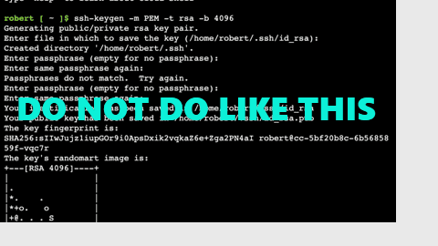

# Task Submission Guidelines

When presenting the results of the practical tasks, please follow these guidelines:

1. Please compile your **screenshots** into a single **PDF or DOCX** file. You are encouraged to include comments on the screenshots to provide context and explanations.
2. If you have recorded a **demo**, please present it as a **GIF** or **MP4** file. These formats will help showcase the dynamic aspects of your work effectively. You can attach **GIF** or **MP4** files separately; you can also insert a **GIF** file into a **DOCX** file with other screenshots.
3. Avoid attempting to pack screenshots into a GIF file. Such an approach may result in your assignment being returned for revision.
4. Please add a **link** to the updated solution in a public Git repository to your PDF/DOCX file.

Please use the following sample file name format: **Lastname - Module X.pdf** (e.g.: Stepanov - Module 6.pdf). This will help in organizing and identifying your submissions easily.

Make sure to review the provided samples to get a clear idea of the expected presentation format.

Following these guidelines will help us evaluate your practical task results effectively. If you have any questions or need further clarification, don't hesitate to ask. Good luck with your submissions!

    
     
    <a href="images/Stepanov - Module 6.pdf" target="_blank">Stepanov - Module 6.pdf</a>

    
     
    <a href="images/Stepanov - Module 6 - Demo.gif" target="_blank">Stepanov - Module 6 - Demo.gif</a>

    
     
    <spam style="color: red;">Please don't do it</spam>

