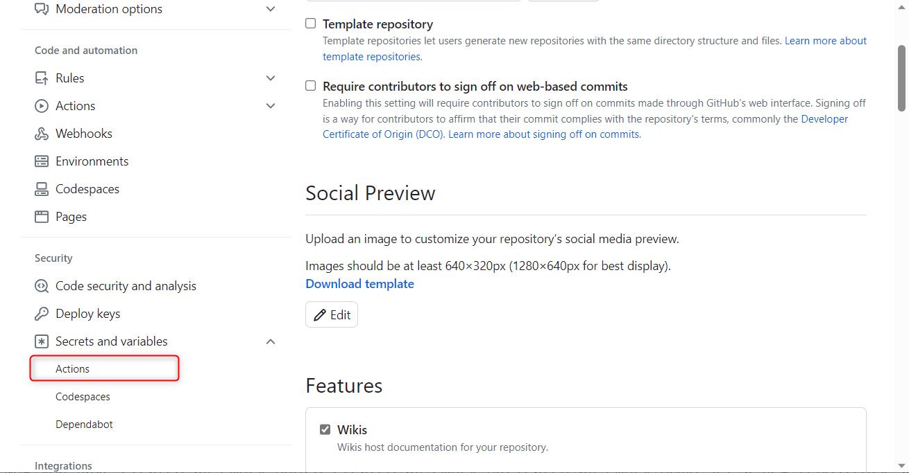
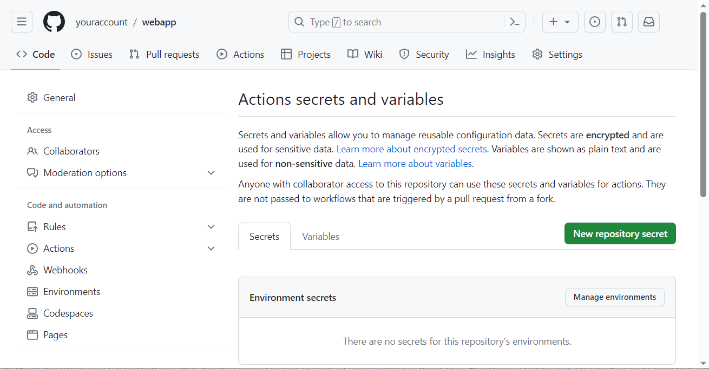
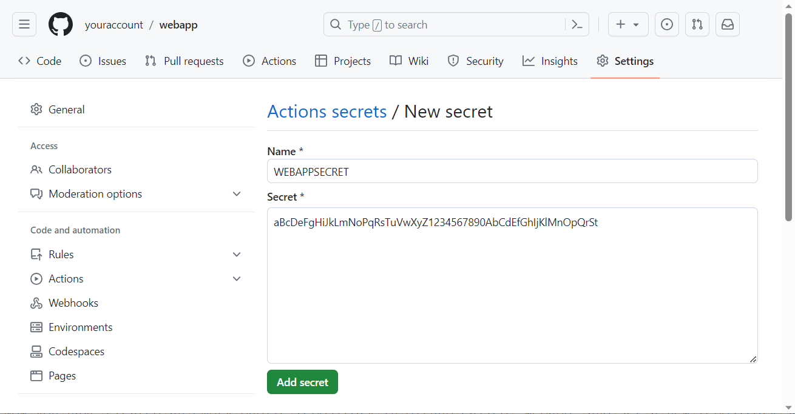
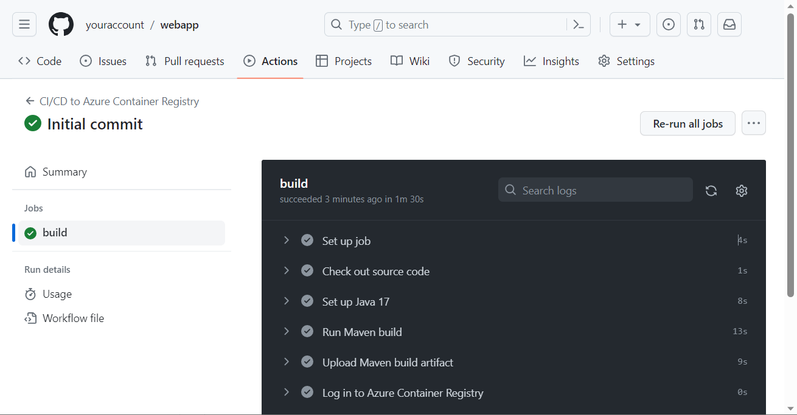
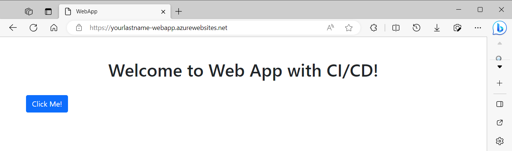

# Module 2: Azure CLI. Introduction to Azure Container Registry and App Services

**Please complete the following task:**

<!-- TOC -->
* [Subtask 0: Definitions](#subtask-0-definitions)
* [Subtask 1: Installing Azure CLI](#subtask-1-installing-azure-cli)
* [Subtask 2: Resource Groups](#subtask-2-resource-groups-)
* [Subtask 3: Azure Container Registry (ACR)](#subtask-3-azure-container-registry-acr)
* [Subtask 4: Creating a GitHub repository and setting a secret](#subtask-4-creating-a-github-repository-and-setting-a-secret)
* [Subtask 5: CI/CD to Azure Container Registry with GitHub Actions](#subtask-5-cicd-to-azure-container-registry-with-github-actions)
* [Subtask 6: Creating a Web App in Azure App Services](#subtask-6-creating-a-web-app-in-azure-app-services)
<!-- TOC -->

## Subtask 0: Definitions

You will learn more about the Azure resources from this task in the next module. For now, let's start by providing simple definitions of these Azure resources.

>Subscription: A paid account that provides access to Azure services. It helps you manage and organize Azure resources, billing, and payment in one place.

>Resource Group: A container that helps you organize and manage related Azure resources based on their lifecycle and purpose.

>ACR (Azure Container Registry): A service to store and manage Docker container images, making it easier to deploy containerized applications.

>Repository: A collection of related Docker images within the Azure Container Registry, grouped by a common name.

>App Service Plan: A set of resources and features for hosting your web app on Azure. Determines the resources, pricing, and available features.

>Web App: An application hosted on Azure App Services that serves content or provides functionality to users over the internet. 

## Subtask 1: Installing Azure CLI

1. Install Azure CLI on your local machine.
2. Sign in to Azure CLI.

## Subtask 2: Resource Groups 

*All the commands should be executed in a Bash terminal using variables*

*Refer to the [Azure CLI Commands Cheat Sheet](cheat-sheet.md) if necessary*

1. Set four variables:
  - two for the permanent resource group:
    - name "permanent_rg,
    - location East US.
  - two for the temporary resource group:
    - name "temporary_rg",
    - location West Europe.

2. Use the `az group create` command along with the variables to create a permanent and a temporary resource groups.

3. Use the `az group list` command to list all available resource groups in your subscription.<br>Sample output:
```bash
[
  {
    "id": "/subscriptions/12345678-abcd-4a1b-89cd-12a3b4c5d6e7/resourceGroups/temporary_rg",
    "location": "westeurope",
    "managedBy": null,
    "name": "temporary_rg",
    "properties": {
      "provisioningState": "Succeeded"
    },
    "tags": null,
    "type": "Microsoft.Resources/resourceGroups"
  },
  {
    "id": "/subscriptions/12345678-abcd-4a1b-89cd-12a3b4c5d6e7/resourceGroups/permanent_rg",
    "location": "eastus",
    "managedBy": null,
    "name": "permanent_rg",
    "properties": {
      "provisioningState": "Succeeded"
    },
    "tags": null,
    "type": "Microsoft.Resources/resourceGroups"
  }
]
```

4. Change the previous command to get a table.<br>Sample output:
```bash
Name                            Location    Status
------------------------------  ----------  ---------
temporary_rg                    westeurope  Succeeded
permanent_rg                    eastus      Succeeded
```

5. Use the `az group show` command to output detailed information about the permanent resource group.<br>Sample output:
```bash
{
  "id": "/subscriptions/12345678-abcd-4a1b-89cd-12a3b4c5d6e7/resourceGroups/permanent_rg",
  "location": "eastus",
  "managedBy": null,
  "name": "permanent_rg",
  "properties": {
    "provisioningState": "Succeeded"
  },
  "tags": null,
  "type": "Microsoft.Resources/resourceGroups"
}
```

6. Use the `az group list` command to list as a table and filter resource groups, using the variable in which you stored the location of the permanent resource group.<br>Sample output:
```bash
Name                          Location
----------------------------  ----------
permanent_rg                   eastus
```

7. Use the `az group show` command to save the permanent resource group ID to a variable and output it.<br>Sample output:
```bash
/subscriptions/12345678-abcd-4a1b-89cd-12a3b4c5d6e7/resourceGroups/permanent_rg
```

8. Use the `az group delete` command along with the variable containing the name of the temporary resource group to delete it. Use a necessary option to do it without being prompted for additional confirmation.

9. Check if the temporary resource group has been deleted. List all available resource groups in your subscription again as a table. Make sure the temporary resource group is no longer listed among the available resource groups. The permanent resource group should still be present.<br>Sample output:
```bash
Name                            Location    Status
------------------------------  ----------  ---------
permanent_rg                    eastus      Succeeded
```

## Subtask 3: Azure Container Registry (ACR)

*All the commands should be executed in a Bash terminal using variables*

*Refer to the [Azure CLI Commands Cheat Sheet](cheat-sheet.md) if necessary*

1. Set a variable for the Azure Container Registry name (use alphanumeric characters only).

2. Use the `az acr create` command to create an Azure Container Registry in the permanent resource group with the Basic service tier (SKU - Stock-Keeping Unit) and enabling the admin user authentication feature.

3. Use the `az resource list` command to list the resources in the permanent resource group. Use the proper option to get a table.<br>Sample output:
```bash
Name                   ResourceGroup    Location    Type                                    Status
---------------------  ---------------  ----------  --------------------------------------  --------
yourcontainerregistry  permanent_rg     eastus      Microsoft.ContainerRegistry/registries
```

4. Use the `az acr credential show` command to retrieve the username and password. Use `--output yaml` option. This will display the credentials in a YAML format. Please make sure to save them for the next subtask.<br>Sample output:
```bash
passwords:
- name: password
  value: aBcDeFgHiJkLmNoPqRsTuVwXyZ1234567890AbCdEfGhIjKlMnOpQrSt
- name: password2
  value: AZYXWVUTSRQPONMLKJIHGFEDCBzyxwvutsrqponmlkjihgfedcba9876
  username: yourcontainerregistry
```

## Subtask 4: Creating a GitHub repository and setting a secret

1. Go to https://github.com and sign in to your GitHub account.

2. Create an empty public repository, set the repository name as "webapp." Please don't add `README` or `.gitignore` files.


3. Please make sure to save the link to your repository (e.g., https://github.com/youraccount/webapp.git).


4. Click on the "Settings" tab.


5. In the left sidebar, under the "Security" section, click on "Secrets and variables" > "Actions."



6. Click on the "New repository secret" button.



7. Set the name of the secret as "WEBAPPSECRET", enter the value of your Azure Container Registry password (`password 1`) that you saved from Subtask 3, and click "Add secret."



## Subtask 5: CI/CD to Azure Container Registry with GitHub Actions

1. Download and unpack the <a href="attachment/webapp.zip" target="_blank">attachment/webapp.zip</a> file.

2. Navigate to the `webapp` folder.

3. Inspect the provided `Dockerfile` which serves as a set of instructions for Docker on building an image for the web application:
    - Use the `maven:3.8.4-openjdk-17-slim` base image for the build stage.
    - Set working directories for both build and runtime stages.
    - Copy the `pom.xml` and the `src` directory to the build working directory.
    - Build the application by running the `mvn clean package` command.
    - Use `openjdk:17-jdk` as the base image for the runtime stage.
    - Define an argument to accept the JAR file name (`webapp-0.0.1-SNAPSHOT.jar`), and copy it from the build stage to the runtime working directory.
    - Expose the application's port (8080).
    - Start the Spring Boot application using the `java -jar` command.

4. Go to the `.github/workflows/` directory.

5. Inspect the provided `ci_cd.yml` file which is a GitHub Actions workflow configuration file. It defines a CI/CD (Continuous Integration and Continuous Deployment) process that triggers on push events to the `master` branch. This process comprises several steps:
    - Check out the source code from the `master` branch.
    - Set up Java 17 environment for the build.
    - Execute a Maven build, which includes updating snapshots and verifying the build.
    - Upload the Maven build artifact, which is a JAR file.
    - Log in to the Azure Container Registry that stores your Docker images.
    - Build and push the Docker image to Azure Container Registry, tagging it with both latest and the GitHub commit SHA.

6. Update the environment variables with your values that you saved from Subtask 3:
    - `AZURE_CONTAINER_REGISTRY: yourcontainerregistry.azurecr.io`
    - `AZURE_CONTAINER_REGISTRY_USERNAME: yourcontainerregistry`

7. Open a terminal and navigate to the root folder of the project.

8. Initialize a new Git repository by running the command:
```bash
git init
```

9. Add all the files in the directory to the Git repository by running the command:
```bash
git add .
```

10. Commit the changes by running the command:
```bash
git commit -m "Initial commit"
```

11. Connect your local repository to the remote repository by running the command:
```bash
git remote add origin https://github.com/<youraccount>/webapp.git
```

12. Ensure that the current branch is named `master` before pushing it to the remote repository:
```bash
git branch -M master
```
`-M` is an option that tells Git to forcefully rename the branch.

13. Push the changes to the remote repository by running the command:
```bash
git push -u origin master
```
`-u` (or `--set-upstream`) is an option that sets the tracked remote branch so that future `git push` and `git pull` commands on this branch work without additional arguments.

14. Visit your GitHub repository and open the "Actions" tab to check the CI/CD process.

<br>


*Next, all the commands should be executed in a Bash terminal using variables*

*Refer to the [Azure CLI Commands Cheat Sheet](cheat-sheet.md) if necessary*

15. Use the `az acr repository list` command to list the repositories in "yourcontainerregistry". Use the proper option to get a table.<br>Sample output:
```bash
Result
--------
webapp
```

16. Use the `az acr repository show-tags` command to display the Docker image tags for the "webapp" repository.<br>Sample output:
```bash
Result
----------------------------------------
a1b2c3d4e5f6g7h8i9j0k1l2m3n4o5p6q7r8s9t0
latest
```

17. Navigate to the `webapp/src/main/resources/templates/` folder of the project and open the `home.html` file.

18. Edit the file and change the `<h1>` title to "Welcome to Web App with CI/CD!".

19. Commit and push your changes.

20. After the GitHub Actions workflow finishes executing, check your Azure Container Registry repository for the new Docker image with an updated tag corresponding to the new commit SHA.

21. Use the `az acr repository show-tags` command with `--orderby time_desc` option to find the oldest image.<br>Sample output:
```bash
Result
----------------------------------------
latest
z9y8x7w6v5u4t3r2q1p0o9n8m7l6k5j4i3h2g1a0
a1b2c3d4e5f6g7h8i9j0k1l2m3n4o5p6q7r8s9t0
``` 

22. Use the `az acr repository delete` command with the full SHA of the oldest image (in our case, `a1b2c3d4e5f6g7h8i9j0k1l2m3n4o5p6q7r8s9t0`) and the `-y` option to delete it. The `-y` option is used to automatically confirm the deletion without waiting for interactive user input.

23. Recheck that the oldest image has been deleted.

## Subtask 6: Creating a Web App in Azure App Services

*All the commands should be executed in a Bash terminal using variables*

*Refer to the [Azure CLI Commands Cheat Sheet](cheat-sheet.md) if necessary*

1. Use the `az group create` command to create a temporary resource group in East US location.

2. Use the `az appservice plan create` command to create an App Service plan in East US location.<br>Use these options among others:

   - `--sku B1`: Sets the pricing tier (SKU) for the App Service plan. In this case, it is set to Basic tier with B1 size. The Basic tier offers dedicated compute resources and custom domains with SSL support. B1 size includes 1 core, 1.75 GB memory, and 10 GB storage.
   - `--is-linux`: Indicates that the App Service plan should use a Linux-based environment for running the applications. This option is useful when deploying applications that require a Linux operating system, like containerized applications using Docker.

3. Use the `az webapp create` command to create the web app and deploy the container image.<br>Use this option among others:

   - `--deployment-container-image-name`: Specifies the container image that will be deployed to the web app. This option sets the fully qualified image path, including the Azure Container Registry name, repository name, and tag.

4. Wait a few minutes for the web app to be deployed and accessible.

5. Open your web browser and visit the web app at the following address:
```bash
https://yourlastname-webapp.azurewebsites.net
```
Replace `yourlastname-webapp` with the actual name of your web app.



6. Once you have confirmed that the web app is running correctly, to save costs, delete the temporary resource group using the following command:
```bash
az group delete --name <temporary-resource-group-name> -y --no-wait
```
This deletes the *temporary* resource group and all resources within it, including the App Service plan and the web app. The `-y` option confirms the deletion without prompting for confirmation, and the `--no-wait` option makes the command execute asynchronously, without waiting for the deletion to complete (to save time and speed up the process).

7. If you prefer, you can retain the *permanent* resource group containing the Azure Container Registry for use in other tasks. However, you can also remove all the repositories in the Azure Container Registry since they are no longer needed for your study:
```bash
for repo in <your-repository-name>; do az acr repository delete --name <your-container-registry-name> --repository $repo -y; done
```

<hr>

In your next tasks, you can categorize your Azure resources by using a *permanent* resource group for resources that do not consume a lot of money and *temporary* resource groups for resources that require more money and should be removed immediately after use.

**Permanent resource group examples:**
- Azure Container Registry (ACR)
- Application Insights instance
- Key Vault

**Temporary resource group examples (remove immediately after use):**
- Azure App Services with App Service Plans and Web Apps
- Azure Container Apps
- Traffic Manager
- Azure Functions
- Azure Blob Storage
- Azure Database for PostgreSQL
- CosmosDB
- Service Bus
- Logic Apps
- etc.

Using this approach, you can optimize your Azure resource management, ensuring that you only use and pay for the resources that are necessary for your tasks.

<hr>

**Consider providing the following screenshots as evidence of your task execution:**

1. *Subtask 2: Resource Groups*
   - Screenshot of the Bash terminal showing variables set for both permanent and temporary resource groups.
   - Screenshot of the `az group list` command and its output, listing available resource groups.
   - Screenshot of the `az group list` command and its output, formatted as a table.
   - Screenshot of the `az group show` command and its output for the permanent resource group.
   - Screenshot of the `az group list` command and its output, filtered by location.
   - Screenshot of saving the permanent resource group ID to a variable.
   - Screenshot of the successful deletion of the temporary resource group.
   - Screenshot of the `az group list` command and its output after deletion, showing only the permanent resource group.

2. *Subtask 3: Azure Container Registry*
   - Screenshot of setting a variable for the Azure Container Registry name.
   - Screenshot of the successful creation of an Azure Container Registry.
   - Screenshot of the `az resource list` command and its output, showing the created Azure Container Registry.

3. *Subtask 6: Creating a Web App in Azure App Services*
   - Screenshots of the Bash terminal showing:
      - Creation of a temporary resource group.
      - Creation of an App Service plan.
      - Creation of a web app and deployment of the container image.
      - Successful deletion of the temporary resource group.
   - Screenshot of the web app running in a web browser.

<hr>

<div style="border: 1px solid #ccc; background-color: #eee;">
  <ul>
    <li>When presenting the results of the practical tasks, please <a href="../common/presenting-results/presenting-results.md">follow these guidelines</a>.</li>
    <li>An <a href="images/Module-2-example.pdf">example of completing</a> Module 2.</li>
    <li>When you have completed the task, attach the file(s) to the "Answer" field, and click "Submit."</li>
    <li>Delete unnecessary resources.</li>
  </ul>
</div>

<hr>

>**IMPORTANT! Make sure to delete resources when they are no longer needed, to save costs and keep your environment clean.**
