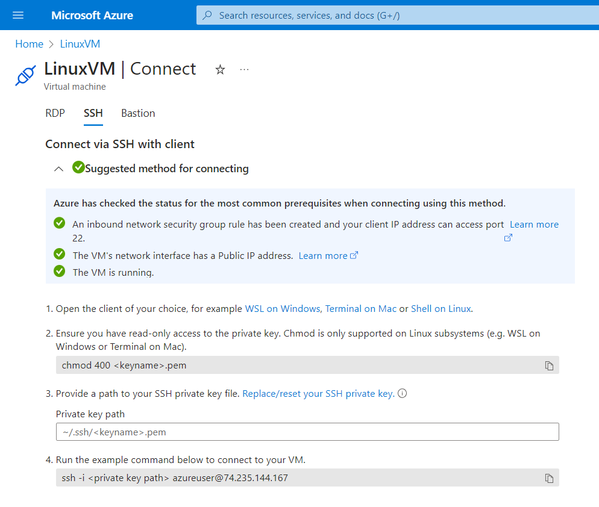
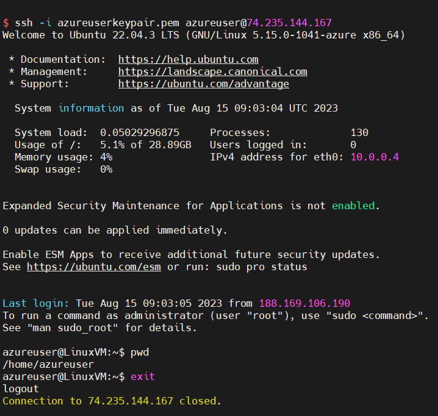

# Connecting to Azure Linux VM Using SSH

## Why We Need This Connection
Connecting to an Azure Linux Virtual Machine (VM) using SSH (Secure Shell) is essential for managing and maintaining your VM remotely. SSH provides a secure and encrypted way to access your VM's command-line interface, allowing you to execute commands, configure settings, and troubleshoot issues without having to use the VM's graphical user interface.



## Retrieve VM Details
Before connecting to your Azure Linux VM, you need to gather some essential information:

1. **Public IP Address or DNS Name**: This is the address you'll use to connect to your VM.
2. **Username**: The username associated with your VM's Linux distribution (e.g., "azureuser" for Ubuntu).
3. **Private Key**: The private key used for authentication.

## Where to Find Private Key
When you created your Azure Linux VM, you generated an SSH key pair. The private key is typically stored on your local machine. If you're using Windows Subsystem for Linux (WSL) on Windows or Terminal on Mac/Linux, the key is often located in the `~/.ssh` directory.

## Ensure Read-Only Permissions for Your Private Key (First Connection)
For security reasons, you should ensure that your private key file has the correct permissions to prevent unauthorized access. In your terminal, use the following command:

```sh
chmod 400 ~/.ssh/your-private-key.pem
```

Replace `your-private-key.pem` with the actual name of your private key file.

## Establish Connection
### Using WSL or Terminal
1. Open your terminal (WSL on Windows or Terminal on Mac/Linux).
2. Use the `ssh` command to establish a connection:

```sh
ssh -i ~/.ssh/your-private-key.pem username@public-ip-or-dns
```

Replace `your-private-key.pem`, `username`, and `public-ip-or-dns` with your actual values.

### Using Command Prompt on Windows
1. Open Command Prompt.
2. Navigate to the directory containing your private key.
3. Use the `ssh` command to establish a connection:

```sh
ssh -i your-private-key.pem username@public-ip-or-dns
```

## Verify Host Authenticity (First Connection)
When connecting for the first time, you'll be prompted to verify the host's authenticity. This is an important security step to ensure you're connecting to the correct server. You'll see a message like:

```
The authenticity of host 'public-ip-or-dns' can't be established.
Are you sure you want to continue connecting? (yes/no)
```

Type `yes` and press Enter to continue.

## Connect to VM, Run Some Commands
Once connected, you can run commands on your Azure Linux VM's command-line interface. This allows you to manage files, install software, and configure settings.




## Disconnecting
To disconnect from the SSH session, simply type `exit` and press Enter. This will close the connection and bring you back to your local terminal.
