# Step-by-Step Guide for Module 3 (App Services)

<!-- TOC -->
  * [Step 0: Prerequisites](#step-0-prerequisites)
  * [Step 1: Set Up Azure Resources](#step-1-set-up-azure-resources)
  * [Step 2: Build and Push Docker Images](#step-2-build-and-push-docker-images)
  * [Step 3: Deploy Services to Azure App Services](#step-3-deploy-services-to-azure-app-services)
  * [Step 4: Configure Auto-Scaling](#step-4-configure-auto-scaling)
  * [Step 5: Set Up Deployment Slots for PetStoreApp](#step-5-set-up-deployment-slots-for-petstoreapp)
  * [Step 6: Configure Traffic Manager](#step-6-configure-traffic-manager)
<!-- TOC -->

## Step 0: Prerequisites

Before you start, make sure you have the following in place:

1. **Azure CLI**: Install the Azure Command-Line Interface (CLI) to interact with Azure services. Download it from: https://docs.microsoft.com/en-us/cli/azure/install-azure-cli

2. **Docker Tools**:
    - **Note**: EPAM has removed Docker Desktop from the standard software toolset, so it cannot be installed on your EPAM devices.
    - **Windows Users**: Set up the Docker Engine using WSL2 following [this guide](../setting-up-docker-on-windows-using-wsl2/setting-up-docker-on-windows-using-wsl2.md). You can also explore other methods for setting up Docker as described [here](https://kb.epam.com/pages/releaseview.action?spaceKey=EPMSAM&title=Docker+Alternatives).
    - **macOS Users**: Use any of the methods described [here](https://kb.epam.com/pages/releaseview.action?spaceKey=EPMSAM&title=Docker+Alternatives) to set up Docker.
    - **Linux Users**: Install the Docker Engine command-line tools on your Linux distribution. Refer to the Docker documentation for installation instructions based on your distribution.

3. **Basic Docker Knowledge**: Understand basic Docker concepts, such as building images from Dockerfiles, tagging images, and pushing them to a container registry.

4. **Cloned Code and Local Setup:** Clone the code, comprehensively review it, and be capable of running PetStoreApp, PetService, ProductService, and OrderService locally within IntelliJ IDEA and Docker as a unified application.


## Step 1: Set Up Azure Resources

1. **Log in to your Azure account**

To log in to your Azure account, you can use the Azure Command-Line Interface (CLI) or the Azure portal. Here are steps for both methods:

- Method 1: Using Azure CLI
   - Open a terminal or command prompt on your computer.
   - Enter the following command:
      ```bash
      az login
      ```
   - A web page will open in your default web browser, prompting you to sign in with your Azure account.
   - Enter your Azure account credentials (email and password) and follow any additional verification steps if prompted.
   - After successful authentication, the terminal will display a list of your Azure subscriptions and their corresponding details. You are now logged in to your Azure account.

   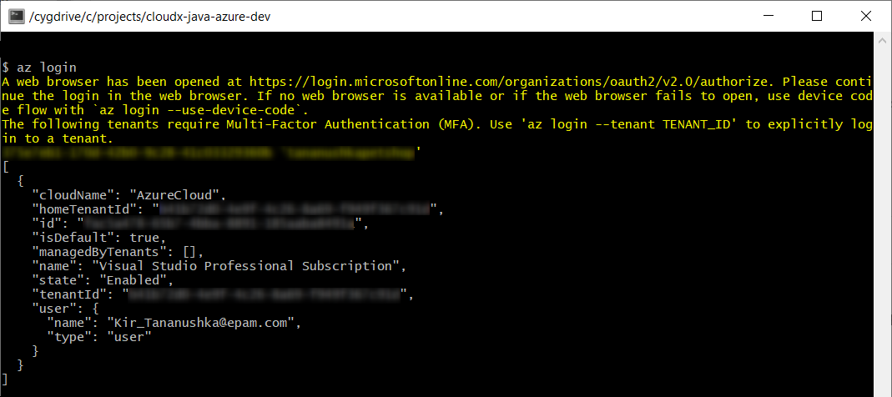

- Method 2: Using Azure Portal
   - Open your web browser and go to the Azure portal: https://portal.azure.com/
   - Click the "Sign In" button located at the top-right corner of the page.
   - Enter your Azure account email and password.
   - If prompted, complete any additional verification steps, such as entering a security code sent to your registered email or phone number.
   - Once successfully authenticated, you will be taken to the Azure portal dashboard, where you can start managing your Azure resources.

After logging in, you can use the Azure portal to create, manage, and monitor your Azure resources, or you can use the Azure CLI to interact with Azure services through the command line.


2. **Create a resource group**
> A resource group is a logical container that holds related resources for an Azure solution and helps you organize and manage your resources efficiently.
- In the Azure portal, click on "Create a resource" and search for "Resource group."

  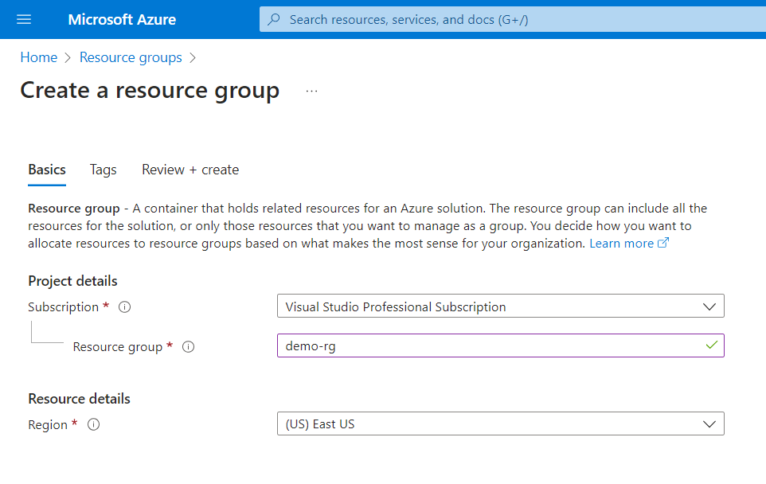

- Choose a name for the resource group, select your subscription (the billing unit for Azure services), and choose a region (the physical location of the resource group).

  

- Click "Review + create" and then "Create."

  


3. **Create an Azure Container Registry (ACR)**
> An Azure Container Registry is a private Docker registry used to store and manage Docker container images.
- In the Azure portal, search for "Container registries" and click "Create."
- Select your subscription.
- Select the same resource group you created earlier. Placing related resources in the same resource group simplifies management.
- Choose a name for the ACR (registry name).
- Choose a region for the ACR. This region should be close to your intended users to reduce latency.
- Select the "Basic" SKU. Azure offers different service tiers with varying features and pricing. For beginners, the Basic tier provides a good starting point.

  

- Click "Review + create" and then "Create." The ACR will serve as a central repository for your Docker images.

  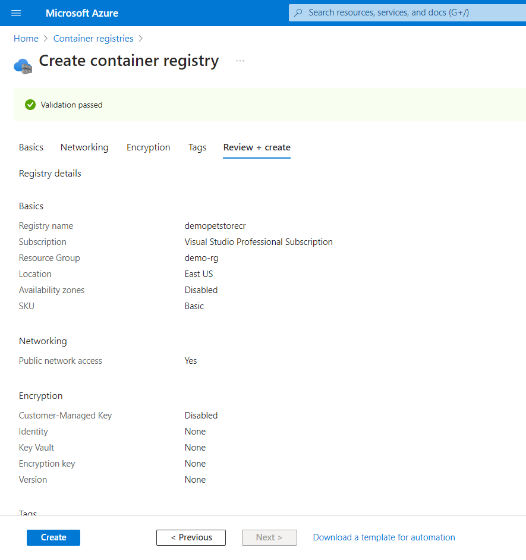


## Step 2: Build and Push Docker Images

> **NOTE**: As an alternative to the approach outlined in Step 2, you may want to consider utilizing CI/CD in conjunction with Azure Container Registry and GitHub Actions (see Module 2).

> Docker is a platform that allows you to create, deploy, and manage applications in lightweight, isolated containers. A Docker image is a self-contained package containing an application and its dependencies, serving as the blueprint for creating and running Docker containers. The Dockerfile contains instructions for building a Docker image.


1. **Build and push Docker images**

- Utilize the existing Dockerfiles for each service (PetStoreApp, PetService, ProductService, OrderService).
- Launch a terminal on your local machine.
- Navigate to the root directories of each project containing the respective service's Dockerfile.
- Build the Docker image using the `docker build` command. This command creates an image based on the instructions in the Dockerfile. Example:
   ```bash
   docker build -t <image-name> .
  ```
- Example (from the `petstore/petstorepetservice/` directory):
   ```bash
   docker build -t petstorepetservice .
   ```
- In this example:
   - `docker build` is the command to build a Docker image.
   - `-t`: the `-t` flag specifies a name for the image.
   - `.`: The dot `.` indicates that the build context is the current directory (where the Dockerfile is located).

   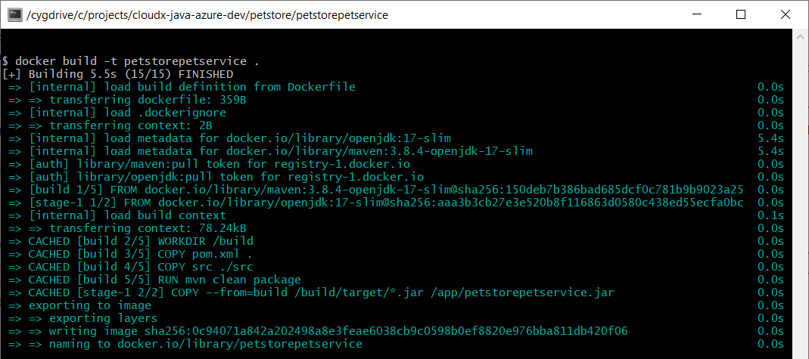


- Log in to your Azure Container Registry (ACR). Logging in is necessary to push images to the ACR:
   ```bash
   az acr login --name <acr-name>
   ```
- Example:
   ```bash
   az acr login --name demopetstorecr .
   ```
- Tag the Docker image using the `docker tag` command. Tagging provides a way to label different versions of your image:
   ```bash
  docker tag <image-name>:<tag> <acr-name>.azurecr.io/<image-name>:<tag>
   ```
- Example:
   ```bash
   docker tag petstorepetservice:latest demopetstorecr.azurecr.io/petstorepetservice:latest
   ```
- If you do not specify a tag when using the `docker tag` command, Docker will assume that you want to assign the default tag, which is `latest`.
- Push the Docker image to ACR using the `docker push` command. Pushing the image makes it available in the ACR repository.
   ```bash
  docker push <acr-name>.azurecr.io/<image-name>:<tag>
  ```
- Example:
   ```bash
   docker push demopetstorecr.azurecr.io/petstorepetservice:latest
   ```

  


- You can use the `az acr build` command to build and push Docker images directly to ACR. This command simplifies the process by combining the build and push steps into one:
   ```bash
   az acr build --image <image-name>:<tag> --registry <acr-name> --file <path-to-Dockerfile> <path-to-context>
   ```
- Here:
   - `--image <image-name>:<tag>`: Specifies the name and tag you want to assign to the built image.
   - `--registry <acr-name>`: Specifies the name of the Azure Container Registry.
   - `--file <path-to-Dockerfile>`: Specifies the path to the Dockerfile for the service.
   - `<path-to-context>`: Specifies the build context, which is the directory containing the application code and files needed for building the image.
- Example (from the `petstore/` directory):
   ```bash
   az acr build --image petstoreapp:latest --registry demopetstorecr --file petstoreapp/Dockerfile ./petstoreapp
   ```

  
  
- Check your Azure Container Registry (ACR).

  


## Step 3: Deploy Services to Azure App Services

>Azure App Services is a platform-as-a-service (PaaS) offering from Microsoft Azure that enables you to build, deploy, and manage web applications and APIs without the complexities of managing underlying infrastructure. With Azure App Services, you can focus on your code and application logic while Azure takes care of the infrastructure, scaling, security, and other operational aspects.

In total, you would need:
- 2 App Service Plans for PetStoreApp (Web) in two different regions.
- 1 App Service Plan for the Public API Services (PetService, ProductService, OrderService) in one region.


1. **Create App Service Plans**

>   An App Service Plan is a fundamental concept in Microsoft Azure that defines the resources and characteristics allocated to host your web applications, APIs, and mobile backends. It's essentially a set of resources that are provisioned in a specific region on Azure to run your applications. App Service Plans allow you to control the performance, scalability, and cost of your hosted applications.

- Create two App Service Plans for PetStoreApp (Web) in two different regions to ensure redundancy and availability.
- Create one App Service Plan for Public API Services  (PetService, ProductService, OrderService) in one region.


  To create App Service Plans in the Azure portal:
- Search for "App Service Plan" and click on "Create."
- For each App Service Plan, configure the following settings:
  - Choose your subscription.
  - Select your resource group.
  - Enter a name for the App Service Plan.
  - Select "Linux" as the operating system.
  - Choose a region from the dropdown list.
  - Select a pricing plan, such as Standard S1 or Premium P1V2.
- Click on 'Review + create,' and then click 'Create' to finalize.

  
  <br>
  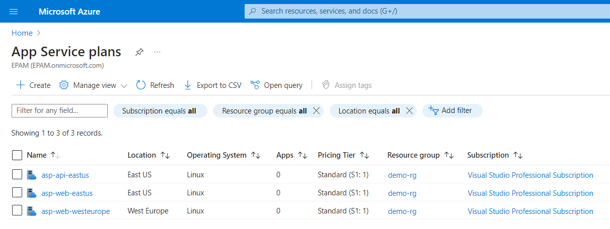

>Select a region that is geographically closer to your intended users for better performance. Customize the resources (CPU, memory) based on the needs of your application. The more resources allocated, the better the app's performance, but it may also impact cost.


2. **Deploy PetStoreApp (Web) to two different regions**

To deploy your Webs in the Azure portal:

- For each region, search for "App Services" and select "Create" > "Web App."
- On the "Basics" tab, configure the following settings:
  - Choose your subscription.
  - Select your resource group.
  - Enter a name for the Web App.
  - Select "Docker Container" as the Publish option, indicating deployment of a Docker container image.
  - Choose "Linux" as the operating system.
  - Pick a region from the dropdown list. Ensure it corresponds to the App Service Plan created for that region.
  - Select the relevant App Service Plan (Linux Plan) to associate the App Service with the plan.
- Move to the "Docker" tab and set up these settings:
  - Choose "Single Container."
  - Select "Azure Container Registry" as the Image Source.
  - Pick your Azure Container Registry's name from the dropdown.
  - Choose the ACR image and tag you previously pushed. This will be the Docker image deployed to the App Service.

  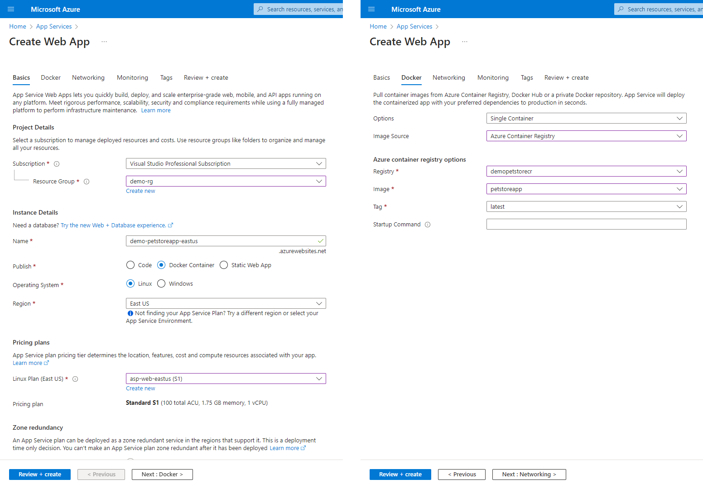

- Click "Review + create," then "Create." Azure will provision the App Service and deploy your Docker image.
- Locate the default domain link on your application page. This link usually follows the format: `https://yourwebappname.azurewebsites.net`. Click on it to open your web app in a browser.

  
  <br>
  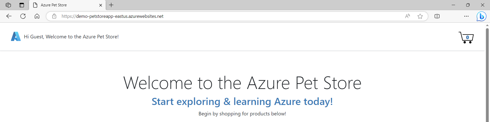


3. **Deploy Public API Services to one region**

- Follow the same deployment steps for each Public API Services (PetService, ProductService, OrderService), selecting the common App Service Plan.

  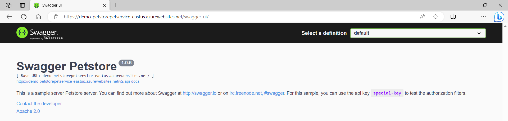


4. **Configure environment variables**

>Environment variables are dynamic values that are used by operating systems, applications, and services to store configuration settings, system paths, and other information that can be accessed and utilized by programs running on a computer or within a cloud environment. These variables provide a way to store data that may vary from system to system or from application to application.

- In each App Service, find the "Configuration" section. This is where you can customize various settings for your app.
- Add environment variables to configure URLs between services. These variables are essential for services to communicate with each other.

  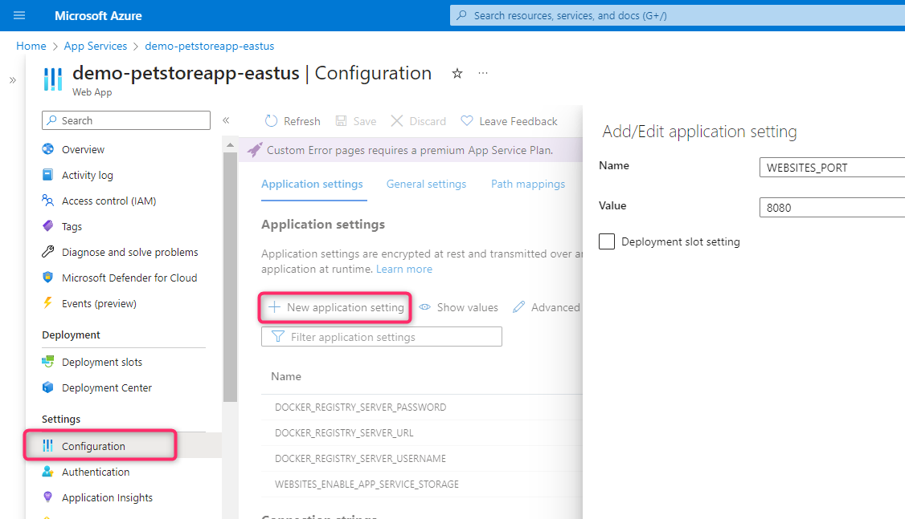
  
- For example, `PETSTOREPETSERVICE_URL` should point to the URL of the PetService. The required environment variables can be found in the `application.yml` file of each service and in the `docker-compose.yml` file used for local development.

  

- Make sure you have set up `WEBSITES_PORT=8080` for each service.
 
- Ensure that all URLs start with `https://`.

- If you've followed all the steps correctly, you should be able to navigate between pages without any errors.

  


## Step 4: Configure Auto-Scaling

>**Auto-scaling** is a cloud platform feature that dynamically adjusts your application's computing resources based on real-time demand. The goal is to efficiently manage varying levels of traffic without manual intervention.

>**Scaling out** involves increasing the instances of your application to manage higher traffic. Instead of making instances more powerful, you add more to distribute the load and maintain performance. This is a common practice in cloud environments and a crucial aspect of auto-scaling.

>**Scaling in**, on the other hand, entails reducing the instances of your application as demand decreases. By doing so, you optimize resource usage and costs, aiming to match the workload efficiently. This strategy complements scaling out and is essential for cost-effective and dynamic resource management, particularly in cloud environments.

>Auto-scaling based on **CPU load** increase automatically adjusts the instances of your application in response to rising CPU utilization. By adding instances when CPU usage surpasses a threshold, this approach handles increased computational demand effectively.


1. **Configure autoscaling**

- In public API services' App Service, find "Scale out (App Service Plan)" in the left menu.
- Select "Rules Based" scale out method and click "Manage rules based scaling."

  

- Choose "Custom autoscale."
- Enter autoscale setting name and choose your resource group.
- Choose "Scale based on a metric mode."
- Set instance limits based on your needs. For example, you can set the minimum to 1, the maximum to 3, and default to 1 instance.
- Click "Add a rule."

  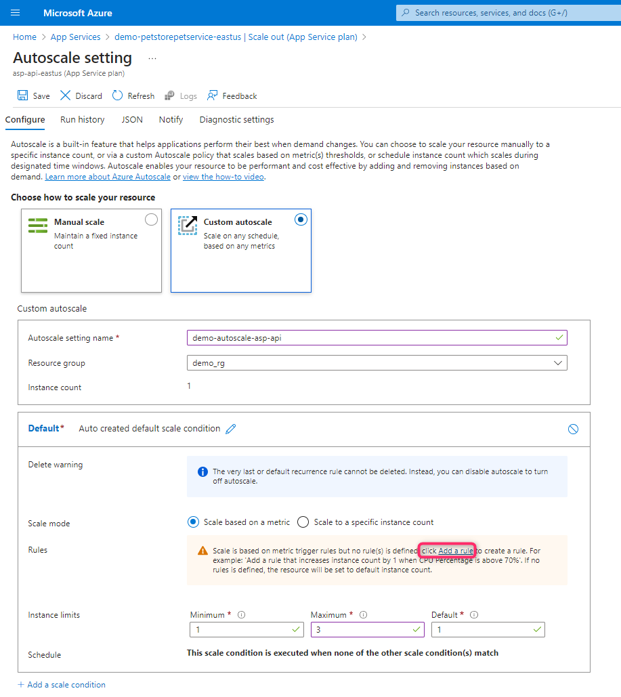
  
- Select current resource as a metric source.
- Configure rules for scaling. For example, you can create a rule to increase the instance count if CPU usage is greater than 70% for 5 minutes. 
- Similarly, you can create a rule to decrease the instance count if CPU usage is less than 25% for 5 minutes.

  

- Do not forget to save your changes.


2. **Test autoscaling using k6 tool**

- To test autoscaling, refer to the guide on testing with the k6 toolk: [Test autoscaling using k6 tool](../using-k6/using-k6.md).
- Utilize Swagger to identify endpoints for testing. For example, employ the `/petstorepetservice/v2/pet/info` endpoint to evaluate PetService autoscaling.

  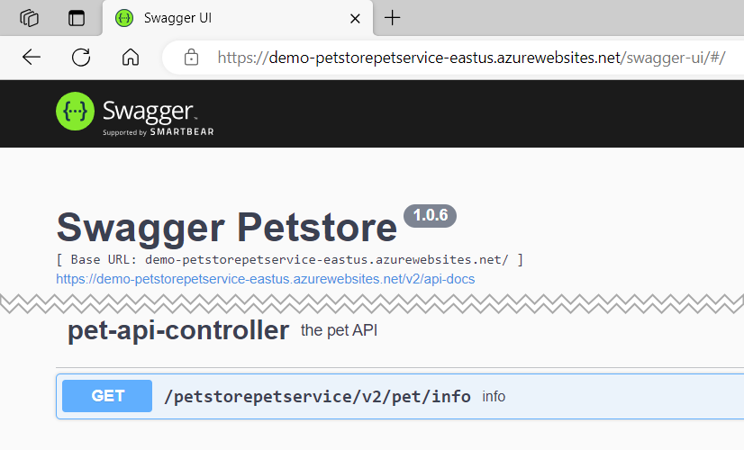
  <br>
  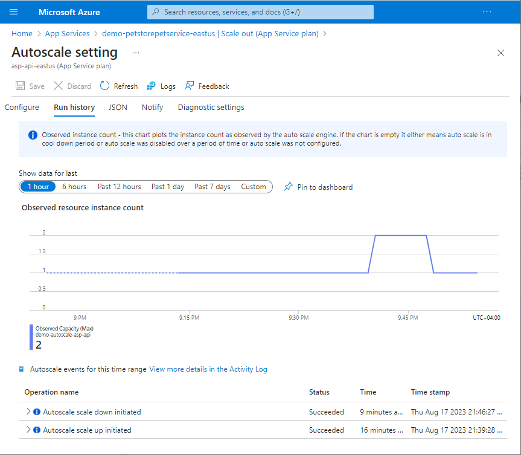


## Step 5: Set Up Deployment Slots for PetStoreApp

>Deployment slots are a feature provided by cloud platforms, including Microsoft Azure, that allow you to create additional environments or instances of your application within a single Azure App Service. Each deployment slot is like a separate copy of your application, allowing you to test changes, updates, or new features in a controlled environment before deploying them to your main production application.


1. **Create a deployment slot for one of PetStoreApps**

- Create a deployment slot:
  - Access the Azure portal and navigate to your PetStoreApp's App Service.
  - In the left menu, locate and click on "Deployment slots."
  - Click on the "Add Slot" button.

  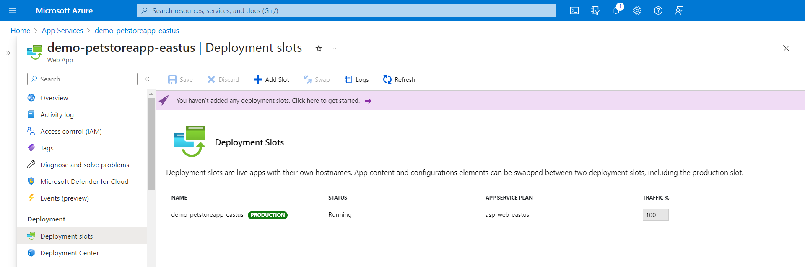

- Configure slot settings:
  - Choose a suitable name for the slot, such as "staging" or "testing." This name will assist in identifying the slot's purpose.
  - After naming the slot, select the "Clone settings from" option, specifically choosing the current application. This action ensures that the slot inherits settings from the main application.
  - This configuration step ensures that the Docker image used in your Azure Container Registry (ACR) will be utilized by the slot.

    
    <br>
    

- Enable continuous deployment:
  - Return to the left menu and locate "Deployment Center."
  - Click on "Deployment Center" to access deployment configuration settings.
  - Within the deployment settings, enable "Continuous deployment." This setting automates the deployment process for the slot.
  - Don't forget to save the changes made to the deployment settings.

  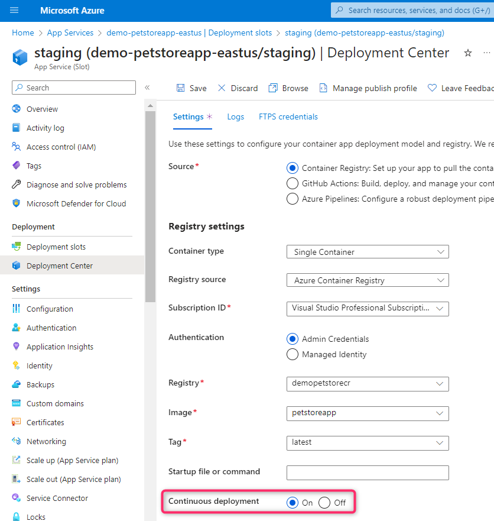


2. **Push updated image to ACR from local computer**

- Whenever you make changes to your application code and want to update the depoyment slot, follow these steps to update the Docker image in ACR:
   - Build the updated Docker image locally.
   - Log in to your Azure Container Registry.
   - Tag the updated image with a new tag if you want to differentiate it from the previous version.
   - Push the updated image to ACR. This updates the image in the ACR repository.
   - Or use `az acr build` command to automatically build the Docker image using the provided Dockerfile and push it to the specified Azure Container Registry.


3. **Test the deployment slot**

- Access the URL of the deployment slot to evaluate the modifications you have implemented.

  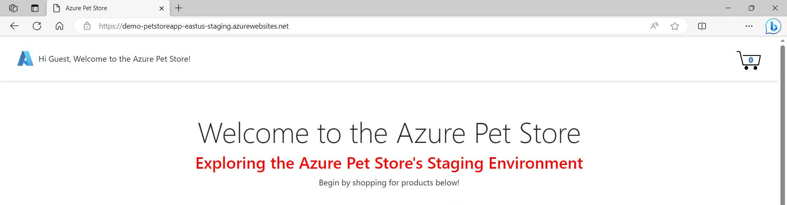

- Confirm that your application works as expected with the new changes.
- Look for the "Swap" button. Click on it to initiate the slot swap process.

  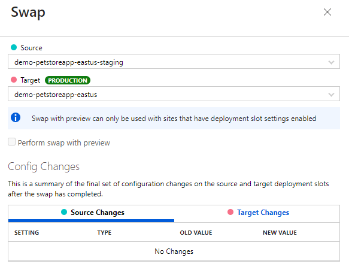

- Perform the swap between the 'staging' and 'production' slots.


## Step 6: Configure Traffic Manager

>A **Traffic Manager profile** is a feature provided by cloud platforms like Microsoft Azure that enables you to distribute incoming network traffic across multiple instances of your application or service. It acts as a global load balancer, directing user requests to the appropriate endpoint based on configured routing methods and health checks. This helps improve the availability, performance, and responsiveness of your application by directing users to the closest or healthiest endpoint.

> A **Traffic Manager endpoint** is a specific destination address, such as a URL or IP address, that represents an instance of your application or service. These endpoints are configured within Azure Traffic Manager to receive and handle incoming network traffic, allowing the load balancer to direct users to the most appropriate endpoint based on routing methods and health checks.

>A **Traffic Manager URL** refers to the endpoint provided by Azure Traffic Manager that directs incoming requests to different instances of an application based on the routing method you've configured. Azure Traffic Manager is a DNS-based traffic load balancer that allows you to distribute incoming traffic across multiple Azure endpoints (such as web apps or services) in different regions or data centers.

1. **Create a Traffic Manager profile**

- In the Azure portal, search for "Traffic Manager profiles" and click on "Create."
- Provide a distinctive name for the profile. This name will establish the exclusive DNS identifier `<profile-name>.trafficmanager.net`," acting as the access point for users.
- Select the preferred routing method. For our scenario, opt for "Priority."

> The "Priority" routing method directs traffic primarily to the highest-priority endpoint, only using others when the top priority is unavailable.

- Indicate your subscription and resource group.

  


2. **Add endpoints**

- In the Traffic Manager profile, go to "Endpoints" and add the two PetStoreApp instances in different regions as endpoints. These endpoints represent the app instances you've deployed in different regions.
- Select "Azure endpoint" as the endpoint type.
- Specify the endpoint's name.
- Choose "App service" as the target resource type.
- Choose the PetStoreApp instance located in the first region as the target resource.
- Set the highest priority ("1") for the first endpoint. The priority defines the order in which Traffic Manager routes traffic. The primary endpoint will be used unless it's unavailable.
- Ensure you have configured health checks to monitor the availability of your endpoints.
- Perform the same sequence of actions for the PetStoreApp instance in the second region, while assigning a priority of "2".

  
  <br>
  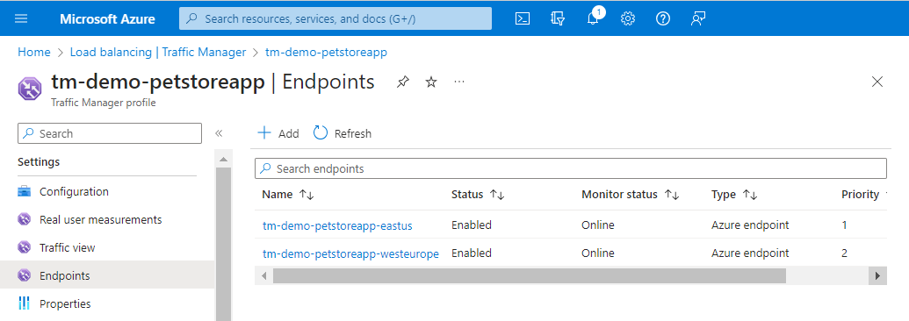


3. **Access the application**
- Use the Traffic Manager URL (i.e., `http://<profile-name>.trafficmanager.net`) to access your PetStoreApp.
- Test main features to ensure the application works as expected.

  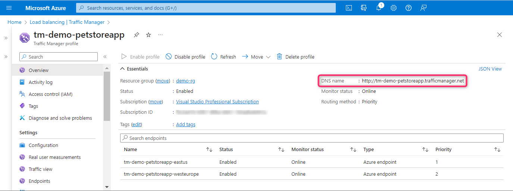
  <br>
  

<hr>

>**IMPORTANT:** Leaving resources running can result in additional costs. Either delete resources individually or remove the entire set of resources by deleting the resource group.
