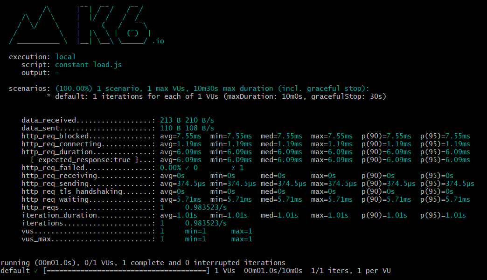
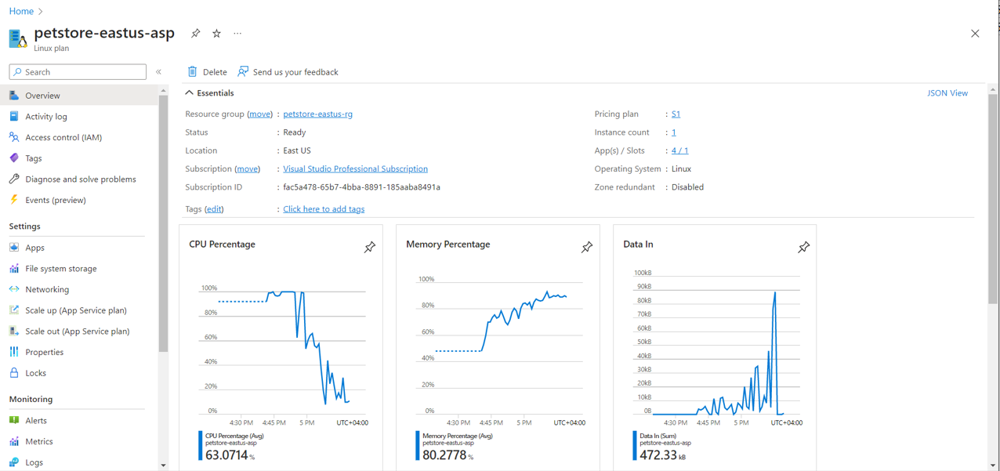

# Testing Using k6 Tool

[k6](https://k6.io/) is an open-source load testing tool designed to help developers and performance engineers test the scalability and performance of their APIs, websites, and other services. It's built with a focus on simplicity, flexibility, and extensibility. k6 uses JavaScript as its scripting language, making it accessible to both developers and testers.

## Testing auto-scaling using k6

Testing auto-scaling for an Azure web app using the k6 tool involves simulating various levels of load to observe how the scaling mechanism of the web app responds. Here's a step-by-step guide on how to do this:

1. **Install k6**:
   If you haven't already, install the k6 tool on your system. You can download it from the official website or use a package manager like Homebrew (on macOS) or Chocolatey (on Windows). See below for more information.

2. **Write a k6 Script**:
   Create a k6 script that sends HTTP requests to your Azure web app's API endpoints. You can use JavaScript to define your test scenario. In this script, you'll define the load you want to generate. For example:

   ```javascript
   import http from 'k6/http';
   import { sleep } from 'k6';

   export default function () {
       http.get('https://your-app.azurewebsites.net/api/endpoint');
       sleep(1); // Adjust the sleep time as needed
   }
   ```

   Make sure to replace `'https://your-app.azurewebsites.net/api/endpoint'` with the actual endpoint of your API.

3. **Define Load Scenarios**:
   Create different load scenarios to test how the auto-scaling responds to different levels of traffic. For example, you can define a scenario with a constant load, a scenario with a gradual ramp-up of users, and a scenario with sudden spikes in traffic. See below for more information.

4. **Run k6 Tests**:
   Open a terminal and navigate to the directory containing your k6 script. Run the k6 test using the following command:

   ```
   k6 run your-script.js
   ```

   Replace `your-script.js` with the actual name of your k6 script.

5. **Observe Scaling Behavior**:
   While the k6 test is running, monitor your Azure web app's scaling behavior. You can use Azure's monitoring tools to track metrics like response times, request rates, and server resource utilization.

6. **Analyze Results**:
   After the test completes, analyze the results to determine how well your web app's auto-scaling mechanism performed. Look for metrics like response times under different load levels and how the number of instances scaled up or down in response to traffic changes.

7. **Iterate and Refine**:
   Based on the results, you might need to iterate and refine your auto-scaling settings. You can adjust parameters like scaling thresholds, instance limits, and cooldown periods to optimize the scaling behavior.

## Installation

To install k6, you can follow these steps based on your operating system:

**1. macOS (Using Homebrew):**

If you're using macOS and have Homebrew installed, you can easily install k6 using the following command:

```sh
brew install k6
```

**2. Windows (Using Chocolatey):**

If you're using Windows and have Chocolatey installed, you can install k6 using the following command:

```sh
choco install k6
```

**3. Linux:**

For Linux, you can download the appropriate binary for your system from the official k6 GitHub releases page: https://github.com/loadimpact/k6/releases

1. Determine whether you're using 32-bit or 64-bit architecture by running the following command in the terminal:
   ```sh
   uname -m
   ```

2. Visit the k6 releases page mentioned above and download the appropriate binary (ZIP or tarball) for your architecture.

3. Extract the downloaded archive to a directory of your choice.

4. Add the path to the k6 binary to your system's PATH environment variable. You can do this by editing your shell's profile configuration file (e.g., `.bashrc`, `.zshrc`) and adding a line like:
   ```sh
   export PATH=/path/to/k6:$PATH
   ```

**4. Using npm (Node.js package manager):**

Alternatively, you can also install k6 using npm if you have Node.js installed on your system:

```sh
npm install -g k6
```

After the installation is complete, you should be able to run the `k6` command in your terminal.

To verify that k6 is installed correctly, you can run the following command:

```sh
k6 --version
```

This should display the version of k6 installed on your system. If you see the version information, you have successfully installed k6 and can proceed with writing and running your load tests.

## Load scenarios

Let's create three different load scenarios using k6 to test how the auto-scaling of your Azure web app responds to various levels of traffic.

**1. Scenario: Constant Load**

In this scenario, we'll simulate a constant load on your web app by sending a steady stream of requests over a period of time.

```javascript
import http from 'k6/http';
import { sleep } from 'k6';

export default function () {
    http.get('https://your-app.azurewebsites.net/api/endpoint');
    sleep(1); // Adjust the sleep time as needed
}
```

**2. Scenario: Gradual Ramp-up of Users**

In this scenario, we'll gradually increase the number of users over time to simulate a realistic increase in traffic.

```javascript
import http from 'k6/http';
import { sleep } from 'k6';

export let options = {
    stages: [
        { duration: '1m', target: 10 },   // Ramp-up to 10 users over 1 minute
        { duration: '5m', target: 10 },   // Stay at 10 users for 5 minutes
    ],
};

export default function () {
    http.get('https://your-app.azurewebsites.net/api/endpoint');
    sleep(1);
}
```

**3. Scenario: Sudden Spike in Traffic**

In this scenario, we'll simulate a sudden spike in traffic by quickly increasing the number of users.

```javascript
import http from 'k6/http';
import { sleep } from 'k6';

export let options = {
    stages: [
        { duration: '1m', target: 10 },    // Ramp-up to 10 users over 1 minute
        { duration: '1m', target: 50 },    // Spike to 50 users in 1 minute
        { duration: '5m', target: 50 },    // Stay at 50 users for 5 minutes
    ],
};

export default function () {
    http.get('https://your-app.azurewebsites.net/api/endpoint');
    sleep(1);
}
```

Remember to replace `'https://your-app.azurewebsites.net/api/endpoint'` with the actual endpoint of your API.

To run these scenarios, save each scenario as a separate JavaScript file (e.g., `constant-load.js`, `gradual-rampup.js`, `sudden-spike.js`) and use the `k6 run` command followed by the filename:

```sh
k6 run constant-load.js
k6 run gradual-rampup.js
k6 run sudden-spike.js
```




Each of these scenarios will help you observe how your Azure web app's auto-scaling responds to different types of traffic patterns. Keep an eye on Azure's monitoring tools to see how the scaling behavior changes in each scenario.
