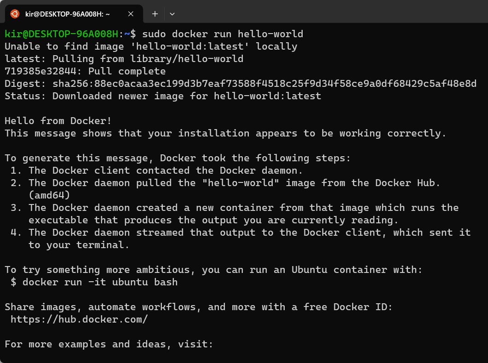

# Setting Up Docker on Windows Using WSL2

<!-- TOC -->
  * [1. Setup WSL2](#1-setup-wsl2)
    * [1.1 Install WSL](#11-install-wsl)
    * [1.2 Set Up Your Linux User Info](#12-set-up-your-linux-user-info)
    * [1.3 Check Which Version of WSL You Are Running](#13-check-which-version-of-wsl-you-are-running)
  * [2. Install Docker Engine on Ubuntu](#2-install-docker-engine-on-ubuntu)
    * [2.1 Uninstall Old Versions](#21-uninstall-old-versions)
    * [2.2 Set Up Docker's apt Repository](#22-set-up-dockers-apt-repository)
    * [2.3 Install Docker Packages](#23-install-docker-packages)
    * [2.4 Verify Docker Engine Installation](#24-verify-docker-engine-installation)
    * [2.5 Add User to Docker Group](#25-add-user-to-docker-group)
  * [3. Install Docker Compose](#3-install-docker-compose)
    * [3.1 Download the Current Stable Release of Docker Compose](#31-download-the-current-stable-release-of-docker-compose)
    * [3.2 Check the Installation](#32-check-the-installation)
<!-- TOC -->

Navigating the world of Docker on Windows can be a challenge, particularly when you want to avoid Docker Desktop. However, with the power of the Windows Subsystem for Linux 2 (WSL2), it's possible to set up a Docker environment directly within your chosen Linux distribution, bypassing the need for Docker Desktop. This alternative approach offers several advantages, including improved performance. In this guide, we will walk you through the process of installing WSL2 and configuring Docker and Docker Compose on Ubuntu within the WSL2 environment.

## 1. Setup WSL2

### 1.1 Install WSL

Open PowerShell or Windows Command Prompt as an administrator and enter the `wsl --install` command, then restart your machine.

```
wsl --install
```

This command activates the necessary features to run WSL and installs the Ubuntu Linux distribution.

   

If you're using an older build or prefer manual installation, see the [Manual installation steps for older versions of WSL](https://docs.microsoft.com/en-us/windows/wsl/install-manual).

Go [here](https://docs.microsoft.com/en-us/windows/wsl/install#install-wsl-command) for more information.


### 1.2 Set Up Your Linux User Info

After installing WSL and restarting your machine, open the WSL terminal (an Ubuntu tab in Windows Terminal). You must create a user account and password for your newly installed Linux distribution.

   

Check [here](https://docs.microsoft.com/en-us/windows/wsl/install#set-up-your-linux-user-info) for more details.

### 1.3 Check Which Version of WSL You Are Running

You can list your installed Linux distributions and check the WSL version of each by entering `wsl -l -v` in PowerShell or Windows Command Prompt.

   

For more info, see [this page](https://docs.microsoft.com/en-us/windows/wsl/install#check-which-version-of-wsl-you-are-running).

## 2. Install Docker Engine on Ubuntu

### 2.1 Uninstall Old Versions

Before you install the Docker Engine, uninstall any existing versions. Open the WSL terminal and run the following command to remove all old versions:

```
for pkg in docker.io docker-doc docker-compose docker-compose-v2 podman-docker containerd runc; do sudo apt-get remove $pkg; done
```

### 2.2 Set Up Docker's apt Repository

Update the apt package index and install packages to allow apt to use a repository over HTTPS:

```
sudo apt-get update
sudo apt-get install ca-certificates curl gnupg
```

Create the Docker apt gpg keyring directory:

```
sudo install -m 0755 -d /etc/apt/keyrings
```

Add Docker's official GPG key:

```
curl -fsSL https://download.docker.com/linux/ubuntu/gpg | sudo gpg --dearmor -o /etc/apt/keyrings/docker.gpg
sudo chmod a+r /etc/apt/keyrings/docker.gpg
```

Set up the stable repository:

```
echo \
  "deb [arch="$(dpkg --print-architecture)" signed-by=/etc/apt/keyrings/docker.gpg] https://download.docker.com/linux/ubuntu \
  "$(. /etc/os-release && echo "$VERSION_CODENAME")" stable" | \
  sudo tee /etc/apt/sources.list.d/docker.list > /dev/null
sudo apt-get update
```

### 2.3 Install Docker Packages

Install the latest version of Docker Engine and `containerd`:

```
sudo apt-get install docker-ce docker-ce-cli containerd.io docker-buildx-plugin docker-compose-plugin
```

### 2.4 Verify Docker Engine Installation

Confirm that Docker Engine is installed correctly by running the `hello-world` image:

```
sudo docker run hello-world
```

   

### 2.5 Add User to Docker Group

For communication over the socket, privileged access is needed. Add your user to the Docker group, `docker`:

```
sudo usermod -aG docker $USER
```

Close the WSL terminal, and relaunch it. When you run `groups`, it should list `docker` among your group memberships.

For more details, visit:

- [Install Docker on Windows (WSL) without Docker Desktop](https://dev.to/bowmanjd/install-docker-on-windows-wsl-without-docker-desktop-34m9)
- [Install Docker Engine on Ubuntu](https://docs.docker.com/engine/install/ubuntu/)

## 3. Install Docker Compose

### 3.1 Download the Current Stable Release of Docker Compose

First, identify the latest release of Docker Compose on [GitHub](https://github.com/docker/compose/releases). Assuming it's version v2.23.0.

Now, open your WSL terminal and run the following:

```
sudo curl -L "https://github.com/docker/compose/releases/download/v2.23.0/docker-compose-$(uname -s)-$(uname -m)" -o /usr/local/bin/docker-compose
```

This command downloads Docker Compose and puts it in `/usr/local/bin/`.

Then, adjust the permissions to allow the binary to be executable:

```
sudo chmod +x /usr/local/bin/docker-compose
```

### 3.2 Check the Installation

Check if Docker Compose has been installed successfully by inspecting the version:

```
docker-compose --version
```

The command should output Docker Compose's installed version, indicating a successful installation.

   
