# Step-by-Step Guide for Module 4 (Container Apps)

<!-- TOC -->
  * [Steps 1 and 2: Set Up Azure Resources, Build and Push Docker Images](#steps-1-and-2-set-up-azure-resources-build-and-push-docker-images)
  * [Step 3: Deploy Services to Azure Container Apps](#step-3-deploy-services-to-azure-container-apps)
  * [Step 4: Configure Autoscaling](#step-4-configure-autoscaling)
  * [Step 5: Deploy Multiple Revisions Simultaneously for PetStoreApp](#step-5-deploy-multiple-revisions-simultaneously-for-petstoreapp)
<!-- TOC -->

## Steps 1 and 2: Set Up Azure Resources, Build and Push Docker Images

Steps 1 and 2 are the same as for Module 3 (App Services).

## Step 3: Deploy Services to Azure Container Apps

1. **Create Azure Container Apps instances**

For this step, you will need to set up:
- One instance of PetStoreApp (Web) deployed as a Container App.
- Three separate Container Apps, each hosting a different Public API Service (PetService, ProductService, OrderService).

All instances (PetStoreApp and the three Public API Services) should ideally be deployed in the same Azure region for optimal performance.

**To create Azure Container Apps instances:**

- Navigate to the Azure portal.
- Use the search bar to find "Container Apps" and select "Create."

  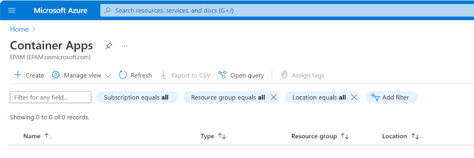

- For each instance, configure as follows:
  - **On the "Basics" tab:**
    - Select your subscription.
    - Create a new or choose an existing resource group.
    - Provide a unique name for the Container App (e.g., "demo-app-eastus").
    - Select your preferred region from the dropdown list (e.g., East US).
    - Create or select an existing Container Apps Environment. If creating a new one, enter a name (e.g., "demo-container-app-env"), choose "Environment type" ("Consumption only"), and set "Zone redundancy" to "Disabled."

  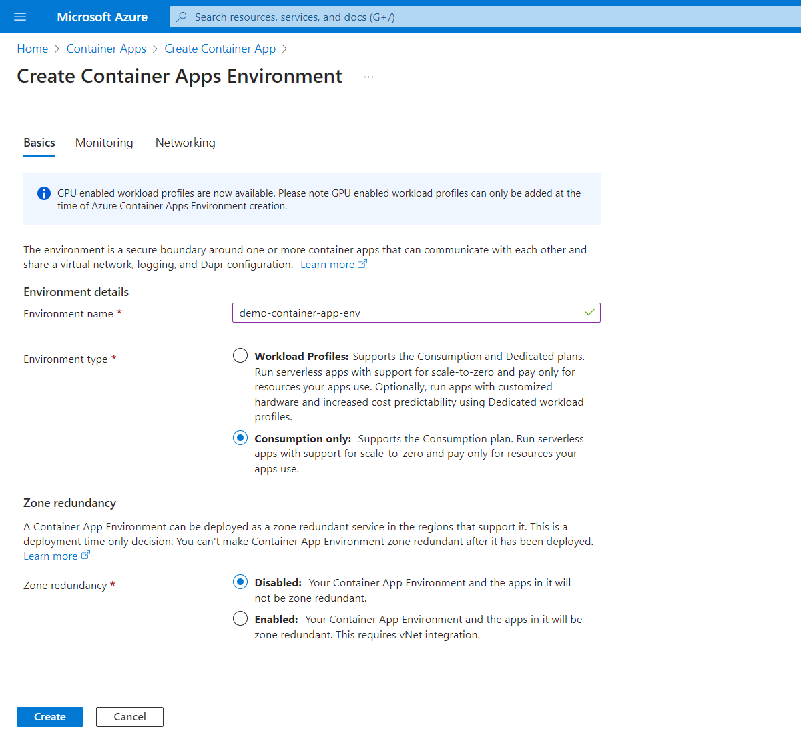
   
  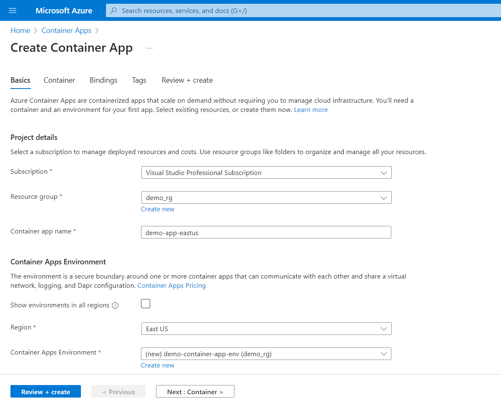

  - **On the "Container" tab:**
    - Leave "Use quickstart image" unchecked (disabled).
    - Enter a name for the container (e.g., "demo-app-eastus").
    - Choose "Azure Container Registry" for "Image source."
    - Select your "Registry," "Image," and "Image tag" (e.g., "demopetstorecr.azurecr.io/petstoreapp:v1").

  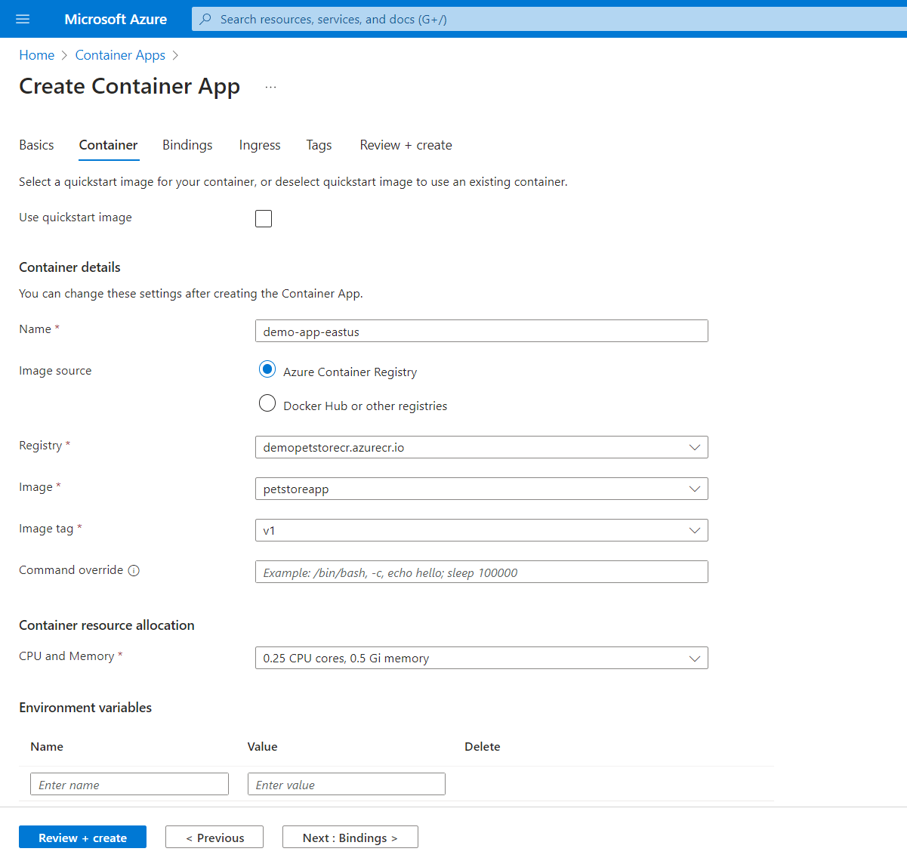

  - **On the "Ingress" tab:**
    - Enable "Ingress".
    - Set "Ingress traffic" to "Accept traffic from anywhere."
    - Choose "HTTP" as the "Ingress type."
    - Set "Client certificate mode" to "Ignore".
    - Select "Auto" for "Transport."
    - Allow "Insecure connections."
    - Specify the "Target port" (e.g., 8080).
    - Ensure that "Session affinity" is unchecked (disabled).

  

  - Click "Review + create," and then "Create" to complete the setup.

  
   
  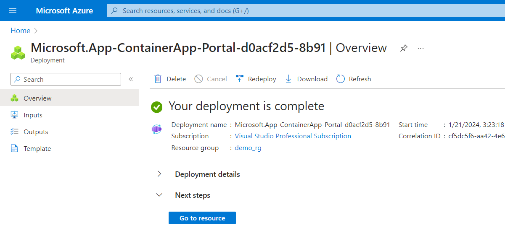

> In Azure Container Apps, **ingress** refers to the rules and configuration for routing external HTTP(S) traffic to specific services within the application. It allows you to define how to access your services from outside your Container App environment, including URL routing, SSL termination, and other settings. You do not need to create an Azure Load Balancer, Public IP address, or any other Azure resources to enable ingress.

In the end, four applications should be created: PetStoreApp, PetService, ProductService, and OrderService.

  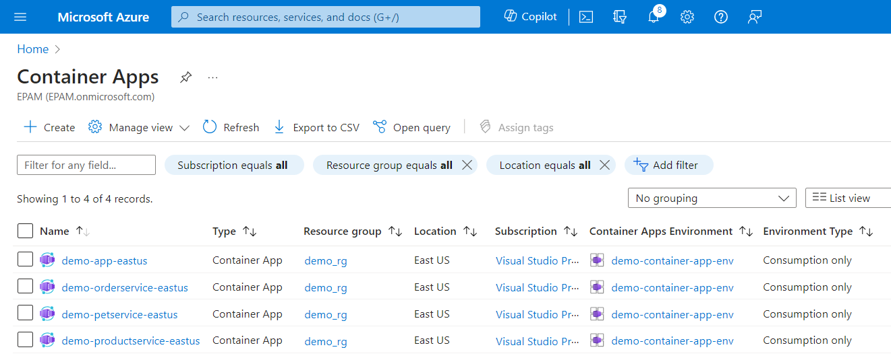

2. **Configure environment variables**

After creating PetStoreApp, PetService, ProductService, and OrderService, configure your environment variables to establish communication between your services. These variables should correspond to the URLs of the applications that were just deployed.

- Locate the required Application URLs. They can be found on the "Overview" tab of each Container App. The URLs will carry the following format: `https://<app-name>.<environment>.<region>.azurecontainerapps.io`. An example of such a URL is: `https://demo-petservice-eastus.icygrass-182e2bd1.eastus.azurecontainerapps.io`.

  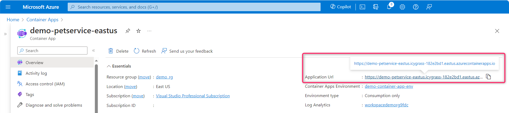

- For each Azure Container App instance:
  - In the navigation pane on the left, select "Revisions."
  - Click the "Create new revision" button.

  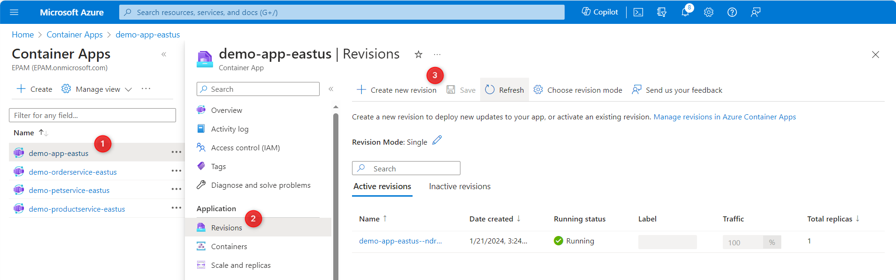

  - **On the "Container" tab of the "Create and deploy new revision" page:**
    - In the "Revision details" section: locate the "Name / Suffix" field and enter the suffix for the revision (e.g., "v1").
    - In the "Container image" section: select the current image and then click the "Edit" button. 

  

  - **On the "Edit a container" tab:**
    - Scroll down to find the "Environment variables" section.
    - Add the required environment variables, using "Manual entry" as a source. For example, `PETSTOREPETSERVICE_URL` should point to the URL of the Pet Service, starting with `https://`.

  

    - Click "Save," then "Create."

Upon successful configuration, the PetStoreApp (Web) should be able to communicate with the Public API Services. Services will then be able to interact with each other as necessary.

  

## Step 4: Configure Autoscaling

In this step, autoscaling parameters will be set up for the PetStoreApp (Web) and the public API services (PetService, ProductService, OrderService) in Azure Container Apps to automatically scale based on concurrent requests.

1. **Configure the PetStoreApp (Web) and the public API services for autoscaling**

- For each Azure Container App instance:
  - In the navigation pane on the left, select "Scale and replicas."
  - Select "Edit and deploy."

  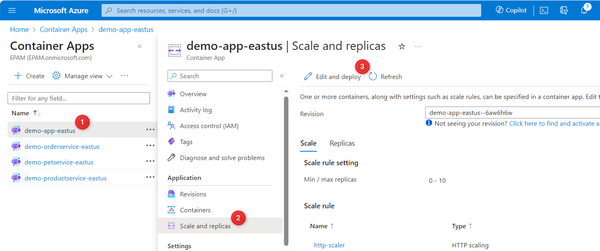
 
  - **On the "Scale" tab of the "Create and deploy new revision" page:**
    - Select the minimum and maximum replica range.
    - Select "Add" in the "Scale rule" section.

  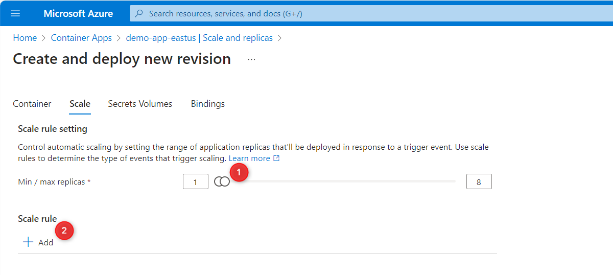

  - **On the "Add scale rule" page:**
    - Provide a name for the rule (e.g., "demo-autoscaler").
    - Select "HTTP scaling" as a "Type."
    - In the "Concurrent requests" box, enter the desired number of concurrent requests for your container app.
    - Click "Add," then "Create."

  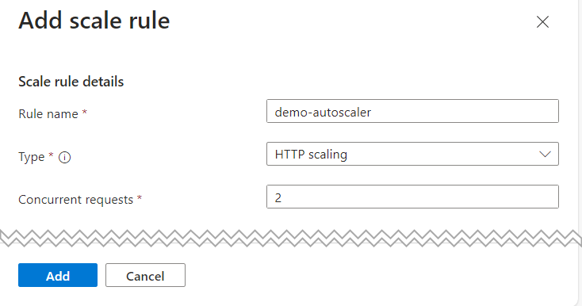

> **Autoscaling based on concurrent requests** in Azure Container Apps allows the system to automatically scale up or down the number of running instances (**replicas**) of your application based on the number of simultaneous requests being handled by the application at any given time.

Repeat this process for all public API services.

2. **Test the autoscaling of public API services using the k6 tool**

- To test autoscaling, refer to the guide on testing with the k6 tool: [Test autoscaling using k6 tool](../../../module-03-appservices/guides/step-by-step-guide/step-by-step-guide.md)
- Utilize Swagger to identify endpoints for testing. For example, employ the `/petstorepetservice/v2/pet/info` endpoint to evaluate PetService autoscaling.

## Step 5: Deploy Multiple Revisions Simultaneously for PetStoreApp

Azure Container Apps allows you to deploy and run multiple revisions of the same image simultaneously. This feature can cater to use cases such as canary deployment, where a new revision of the application is rolled out gradually to a subset of users, or a blue/green deployment, where two versions of the application run concurrently, and traffic is switched between them without downtime.

1. **Ensure the PetStoreApp is configured for autoscaling**

See the previous step.

2. **Ensure the Revision Mode is set to "Multiple"**

Multiple revisions mode allows you to deploy several instances (revisions) of your app simultaneously. It enables you to adjust the settings of your container app and create new revisions without replacing the existing ones. This functionality is key for scenarios such as canary deployments or maintaining a blue/green environment. To confirm or change this setting, follow the steps below:

- For the Azure Container App instance of the PetStoreApp:
  - In the navigation pane on the left, select "Revisions."
  - Ensure that "Multiple" is selected as the "Revision Mode." If it's not, click on "Choose revision mode" and confirm the switch from single to multi-revision mode.
  
  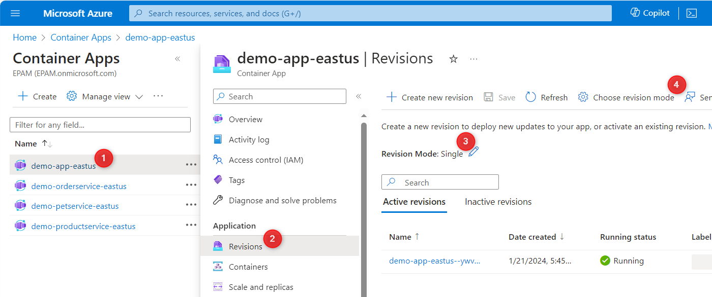
   
  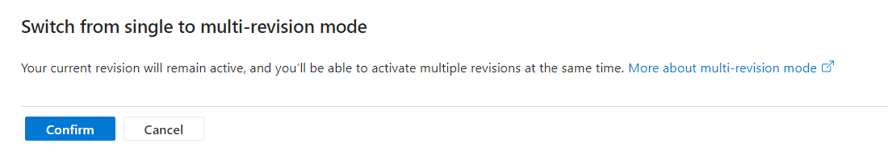

3. **Push updated image to ACR from local computer**

- Whenever you make changes to your application code and want to update the staging environment, follow these steps to update the Docker image in ACR:
  - Build the updated Docker image locally.
  - Log in to your Azure Container Registry.
  - Tag the updated image with a new tag to differentiate it from the previous version (e.g., v2).
  - Push the updated image to ACR. This updates the image in the ACR repository.

  Alternatively, you can use the `az acr build` command to automatically build the Docker image using the provided Dockerfile and push it to the specified Azure Container Registry.

4. **Deploy the newly built image as a new revision**

After pushing the image to ACR, you can create a new revision in Azure Container Apps.

- For the Azure Container App instance of the PetStoreApp:
  - In the navigation pane on the left, select "Revisions."
  - Click the "Create new revision" button.

  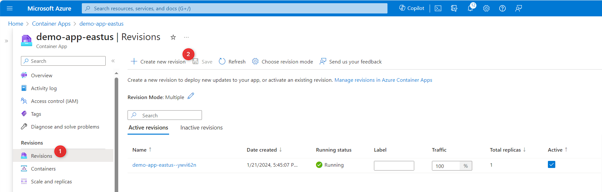

  - **In the "Container" tab of the "Create and deploy new revision" page:**
    - In the "Revision details" section: locate the "Name / Suffix" field and enter the suffix for the new revision (e.g., "v2").
    - In the "Container image" section: select the current image and then click the "Edit" button.

  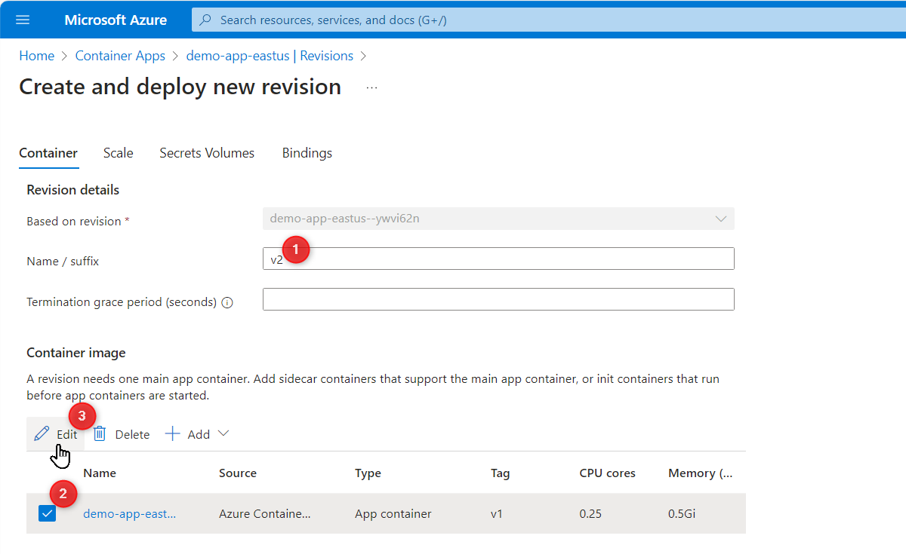

  - **In the "Basics" tab of the "Edit a container" page:**
    - In the "Container details" section: select the tag of the updated image (e.g., change it to "v2").
    - Click "Save," followed by "Create."

  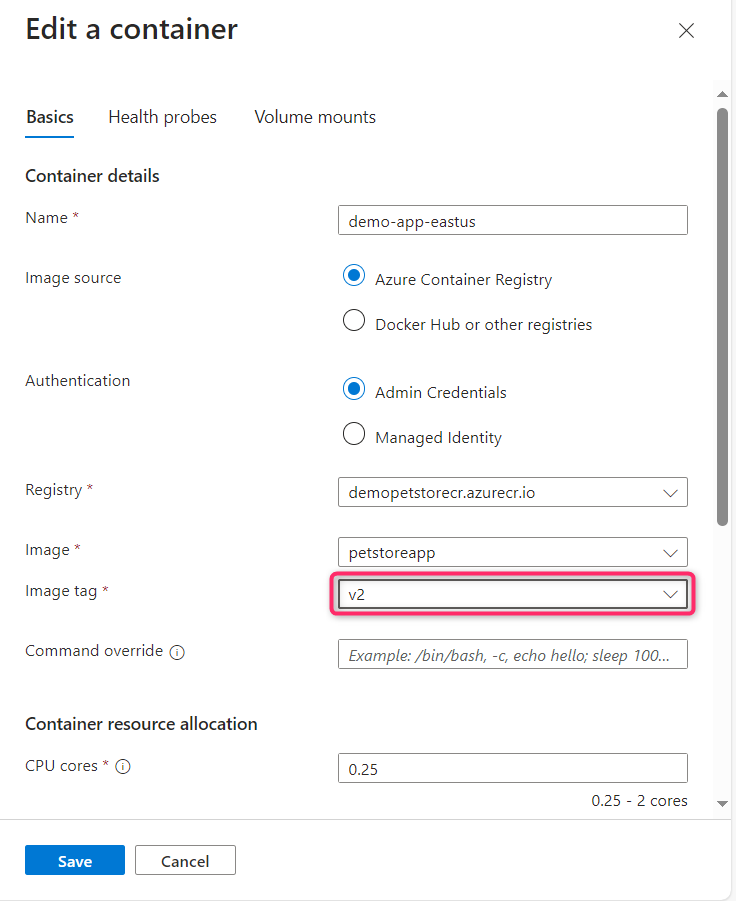

5. **Redirect a portion of traffic to the new revision (Canary deployment) and conduct testing**

   With the new revision up and running, you can gradually redirect a portion of the traffic to it. This is often done to test the new revision.

  - Under "Revisions," in the "Active revisions" tab:
    - Specify the percentage of traffic that should go to the old and new revisions.
    - Click on "Save."

  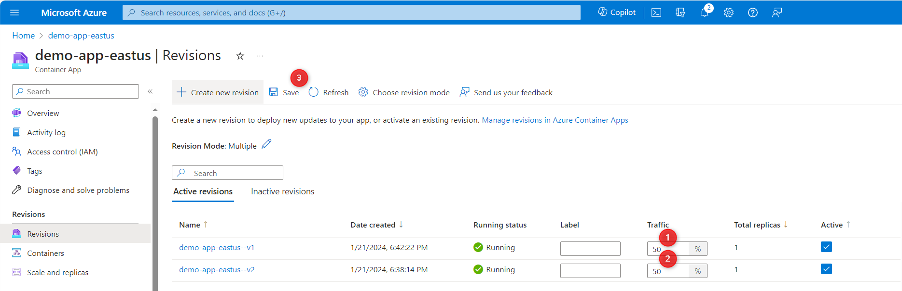

  The system will now distribute traffic between the two revisions based on the specified percentages.

  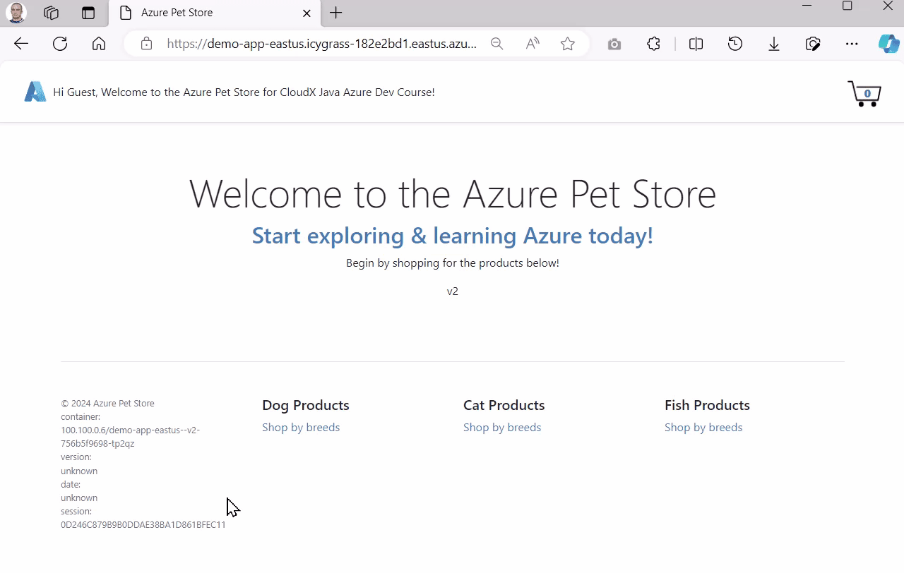

> **NOTE:** Unlike the Application URL on the "Overview" page, for testing revisions, you can use the Revision URL on the "Revisions" -> "Revision details" page. Compare: 
> Application URL: demo-app-eastus.icygrass-182e2bd1.eastus.azurecontainerapps.io 
> Revision URL (v1): demo-app-eastus--v1.icygrass-182e2bd1.eastus.azurecontainerapps.io 
> Revision URL (v2): demo-app-eastus--v2.icygrass-182e2bd1.eastus.azurecontainerapps.io

  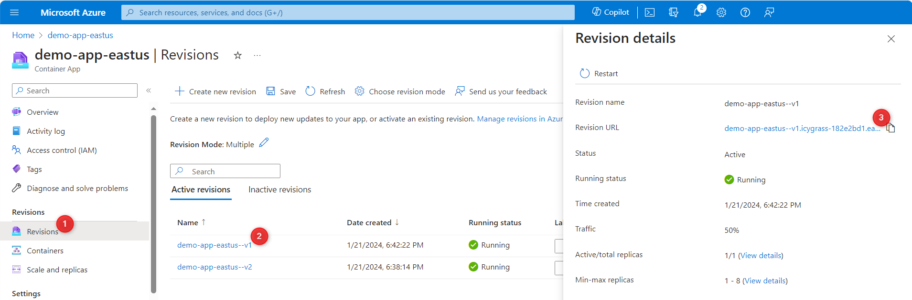
   
  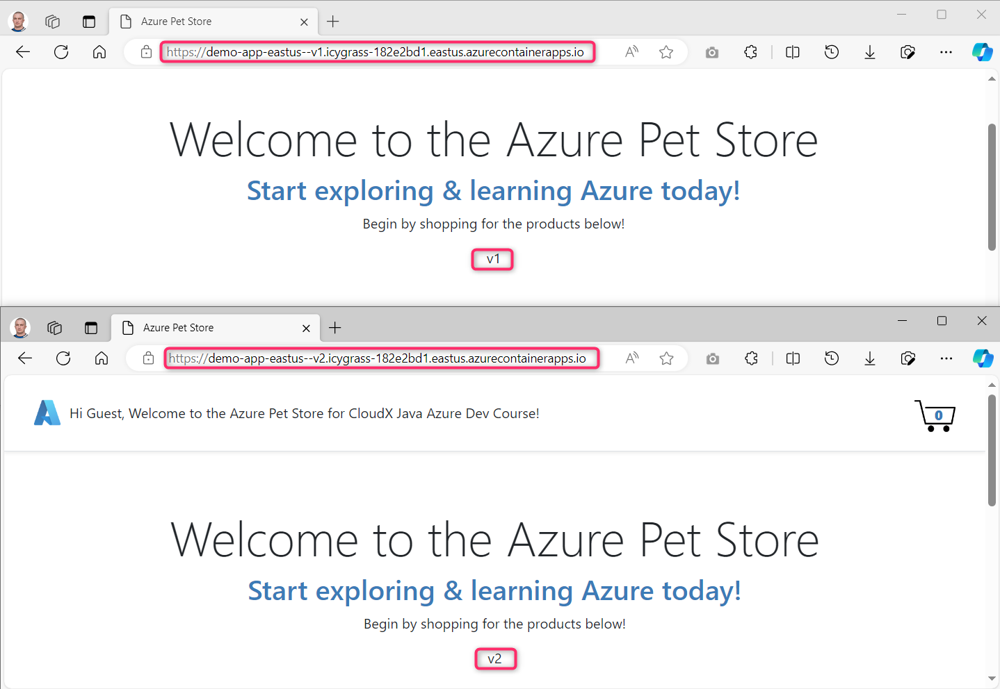

6. **Switch all traffic to the new revision (Blue/Green deployment)**

Once you've tested and verified the new revision, you can redirect all traffic to it:
  - Under "Revisions," in the "Active revisions" tab:
    - Assign 100% to the new revision and 0% to the old one.
    - Uncheck "Active" checkbox for the old one.
    - Click on "Save."

  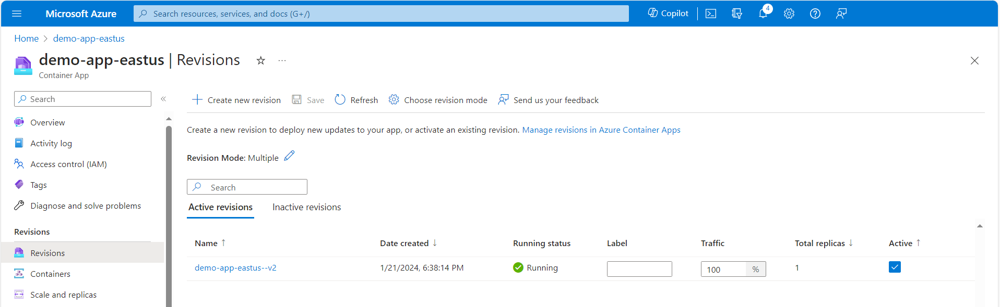

   Now, all incoming requests will be directed to the new revision. The old revision can be kept for possible rollback or deleted if no longer needed.

>**NOTE:** For all subsequent tasks, you have the choice of using either **Azure App Services or Azure Container Apps**.

>**IMPORTANT:** Leaving resources running can result in additional costs. Either delete resources individually or remove the entire set of resources by deleting the resource group.
