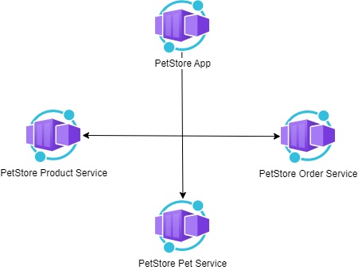

# Module 4: Container Apps

## Task

The source code is available [here](../../../petstore).

**Please complete the following task:**

1. Deploy on Azure Container Apps, all in the same Azure region:
    - the PetStoreApp (Web) as a Container App
    - the Public API Services (PetService, ProductService, OrderService) as three separate Container Apps
2. Set environment variables to enable communication between the Web (PetStoreApp) and the Public API Services.
3. Configure the Public API Services (PetService, ProductService, OrderService) for autoscaling based on concurrent requests.
4. Verify the scalability by testing with tools like k6 to generate a load on the Public APIs.
5. Set up the Web (PetStoreApp) for multi-revision deployments.
6. Deploy updated versions of the PetStoreApp as new revisions.
7. Conduct a Canary deployment by redirecting a portion of traffic to a new revision of the Web (PetStoreApp).
8. Perform a Blue/Green deployment by switching all traffic to the new revision.
9. (Optional) Use Azure CLI in bash scripts to automate Azure resource deployments.

>**IMPORTANT:** Avoid using Kubernetes for this course, as it is not included in the curriculum and could potentially lead to unnecessary expenses.

**Useful links:**

- [Step-by-Step Guide](guides/step-by-step-guide/step-by-step-guide.md)

**Definition of Done:**

1. PetStoreApp and all three Public API Services are successfully deployed as Container Apps in the same Azure region.
2. Environment variables are properly configured.
3. The Web (PetStoreApp) and the Public APIs are set up to scale automatically based on concurrent requests.
4. Autoscaling functionality of the Public API Services is tested and confirmed using the k6 tool.
5. Multiple revisions of the PetStoreApp are deployed simultaneously without disrupting the service.
6. Traffic management for revisions is successfully implemented, demonstrated through Canary and Blue/Green deployment strategies.
7. All applications, including their revisions, are stable and accessible as expected.
8. (Optional) Deployment automation scripts using Azure CLI are implemented and functional.

**Consider providing the following screenshots as evidence of your task execution:**

1. *Deploy Services to Azure Container Apps*
    - Screenshots of the configuration process for each Container App instance (PetStoreApp, PetService, ProductService, OrderService) on the "Basics", "Container", and "Ingress" tabs.
    - Screenshot showing the successful creation of each Container App instance.

2. *Configure Environment Variables*
    - Screenshots of the Application URLs from the "Overview" tab.
    - Screenshots showing the process of adding environment variables in the "Environment Variables" section.

3. *Configure Autoscaling*
    - Screenshots of the "Scale and replicas" settings for each Container App (PetStoreApp, PetService, ProductService, OrderService).
    - Screenshots of the "Add scale rule" configuration for HTTP scaling and concurrent requests settings.

4. *Test Autoscaling using k6 Tool*
    - Screenshots of Swagger endpoints utilized for testing autoscaling.
    - Screenshots of the k6 tool in use for testing autoscaling.
    - Screenshots of the results, particularly showing the scaling behavior under load.

5. *Deploy Multiple Revisions Simultaneously for PetStoreApp*
    - Screenshot showing the "Revisions" settings with "Multiple" selected as the Revision Mode for the PetStoreApp.
    - Screenshots of the "Create new revision" process, including updating the container image tag and the creation of the new revision.
    - Screenshots showing the traffic distribution settings under "Active revisions" for Canary deployment.
    - Screenshots of the final traffic distribution settings for Blue/Green deployment, with 100% traffic directed to the new revision.

6. Screenshots or GIF-file showing the testing process for the main features of the application.
7. A screenshot showing the list of Azure resources that correspond to the diagram.

  <ul>
    <li>When presenting the results of the practical tasks, please <a href="../common/presenting-results/presenting-results.md">follow these guidelines</a>.</li>
    <li><strong>When you have completed the task, attach the file(s) to the "Answer" field. Files should include a PDF/DOCX file with screenshots (optionally, you can also add a GIF/MP4 file). Please add a link to the updated Pet Store solution in a public Git repository to your PDF/DOCX file. Click "Submit."</strong></li>
    <li>Delete unnecessary resources.</li>
  </ul>

>**IMPORTANT:** Leaving resources running can result in additional costs. Either delete resources individually or remove the entire set of resources by deleting the resource group.
