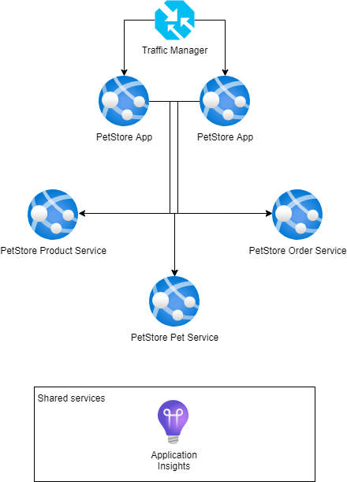

# Module 4: Monitoring and Logging

## Task

The source code is available [here](../../../petstore).

**Please complete the following task:**

1. Create an instance of the Application Insights service.
2. Enable the connection to Application Insights for the PetStore services using the Spring Boot starter and deploy the services.
3. Browse the Pet Store website: add several products to the shopping cart.
4. In Application Insights, check the following:
   - the Overview tab for incoming requests and failures
   - live metrics
   - transaction search
   - performance metrics
5. Implement several changes in the code:
   - in `PetStoreServiceImpl.getProducts()`, add a custom metric (using TelemetryClient) to store information about who is making the request (i.e., username and session)
   - add logging to `PetStoreServiceImpl.getProducts()` for the number of items that were returned to user
   - deploy the services to Azure App Services
6. Examine the logs and custom events.
7. Use a Kusto query to filter all logs by the current session ID (note: this can be found at the bottom left corner of the home page).
8. Introduce an error in `PetStoreServiceImpl.getProducts()` by adding the line:
```java
throw new Exception("Cannot move further");
```
9. Redeploy the service and check the logs in Application Insights.
10. Use a Kusto query to count the number of exceptions containing the text `Cannot move further` from the last hour.
11. Examine the error in more detail by navigating to the Failures Tab in Application Insights and retrieving the stack trace.

**Definition of Done:**

1. Information logs from PetStore services are checked in Application Insights.
2. Error logs are located using the "Failures" tab in Application Insights.
3. Metrics are confirmed updated in the App Service's Metrics tab.



<div style="border: 1px solid #ccc; background-color: #eee;">
  <ul>
    <li>When presenting the results of the practical tasks, please <a href="../common/presenting-results/presenting-results.md">follow these guidelines</a>.</li>
    <li>When you have completed the task, attach the screenshot to the "Result" field, and update the status to "Done."</li>
    <li>Delete resources.</li>
  </ul>
</div>
<hr>

>**IMPORTANT:** Leaving resources running can result in additional costs. Either delete resources individually or remove the entire set of resources by deleting the resource group.