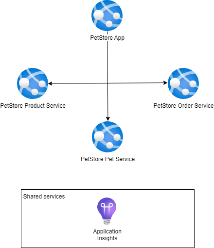

# Module 5: Monitoring and Logging

## Task

The source code is available [here](../../../petstore).

> **NOTE:** For the deployment of services in this and all subsequent tasks, you may choose to use either **Azure App Services or Azure Container Apps** (the diagrams will depict App Services).

**Please complete the following task:**

1. Create an instance of the Application Insights service.
2. Enable the connection to Application Insights for the PetStore services and deploy the services.
3. Browse the Pet Store website: add several products to the shopping cart.
4. In Application Insights, check the following:
   - the Overview tab for incoming requests and failures
   - live metrics
   - transaction search
   - performance metrics
5. Implement several changes in the code:
   - in `PetStoreServiceImpl.getProducts()`, add a custom event or log (using TelemetryClient) to store information about who is making the request (i.e., username and session)
   - add logging to `PetStoreServiceImpl.getProducts()` for the number of items that were returned to the user. Add this quantity as a custom metric
   - deploy the services to Azure App Services or Azure Container Apps
6. Examine the logs and custom events.
7. Use a Kusto query to filter all logs by the current session ID (note: this can be found at the bottom left corner of the home page).
8. Introduce an error in `PetStoreServiceImpl.getProducts()` by adding the line:
```java
throw new Exception("Cannot move further");
```
9. Redeploy the service and check the logs in Application Insights.
10. Use a Kusto query to count the number of exceptions containing the text `Cannot move further` from the last hour.
11. Examine the error in more detail by navigating to the Failures Tab in Application Insights and retrieving the stack trace.
12. (Optional) Utilize Azure CLI to automate resource deployment.

**Definition of Done:**

1. Information logs from PetStore services are checked in Application Insights.
2. Error logs are located using the "Failures" tab in Application Insights.
3. Metrics are confirmed updated in the Metrics tab.



<hr>

**Consider providing the following screenshots as evidence of your task execution:**

1. *Create an Instance of Application Insights*
   - Screenshot showing the creation of an Application Insights instance in the Azure portal.

2. *Enable Connection to Application Insights*
   - Screenshot demonstrating integration with Application Insights.
   - Screenshots of the deployed PetStore services with enabled Application Insights connections.

3. *Browse the Pet Store Website*
   - Screenshots capturing the process of adding multiple products to the shopping cart on the Pet Store website.

4. *Check Application Insights*
   - Screenshots of the Application Insights dashboard:
      - Overview tab displaying incoming requests and failures.
      - Live metrics tab displaying real-time metrics.
      - Transaction search results.
      - Performance metrics relevant to the PetStore services.

5. *Implement Changes in the Code*
   - Screenshot of the added custom metric in `PetStoreServiceImpl.getProducts()`.
   - Screenshot showing added logging for the number of returned items.
   - Screenshots of the deployed PetStore services with implemented code changes.

6. *Examine Logs and Custom Events*
   - Screenshots of Application Insights displaying logged events and custom metrics.

7. *Use Kusto Query to Filter Logs*
   - Screenshot of a Kusto query filtering logs by the current session ID.

8. *Introduce an Error in the Code*
   - Screenshot of the code with the introduced error line.

9. *Redeploy Service and Check Logs*
   - Screenshots of the deployed PetStore services with the introduced error.
   - Screenshots of Application Insights displaying logs related to the error.

10. *Use Kusto Query to Count Exceptions*
   - Screenshot of a Kusto query counting exceptions with specific error messages.

11. *Examine Error in Detail*
   - Screenshot of the "Failures" tab in Application Insights displaying the stack trace of the error.

<hr>

<div style="border: 1px solid #ccc; background-color: #eee;">
  <ul>
    <li>When presenting the results of the practical tasks, please <a href="../common/presenting-results/presenting-results.md">follow these guidelines</a>.</li>
    <li><strong>When you have completed the task, attach the file(s) to the "Answer" field. Files should include a PDF/DOCX file with screenshots (optionally, you can also add a GIF/MP4 file). Please add a link to the updated Pet Store solution in a public Git repository to your PDF/DOCX file. Click "Submit."</strong></li>
    <li>Delete unnecessary resources.</li>
  </ul>
</div>
<hr>

>**IMPORTANT:** Leaving resources running can result in additional costs. Either delete resources individually or remove the entire set of resources by deleting the resource group.
