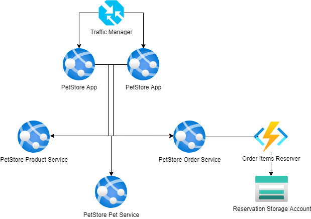

# Module 5: Functions and Storage

## Task

The source code is available [here](../../../petstore).

The PetStore application enables customers to add products to their shopping carts, effectively initializing orders. However, currently, there is no mechanism in place to transmit requests to the storage to reserve the selected items.

**Please complete the following task:**

1. Implement a new OrderItemsReserver service, utilizing Azure Functions.
2. Establish communication between the PetStore application and the OrderItemsReserver through an HTTP call.
3. The OrderItemsReserver should generate order requests and upload them as a JSON file to Blob Storage.
4. This should happen every time a customer updates the shopping cart during the same session.
5. The generated request should contain order details and the product list.
6. Ensure that the file is overwritten for each user session whenever an update is made.

**Definition of Done:**

1. The PetStore application has been modified and deployed to the Azure App Service.
2. The OrderItemsReserver service has been developed and deployed as an Azure Function.
3. Every time a customer updates the shopping cart within the same session, a new JSON file containing the order details appears in Blob Storage.

  <ul>
    <li>When presenting the results of the practical tasks, please <a href="../common/presenting-results/presenting-results.md">follow these guidelines</a>.</li>
    <li>When you have completed the task, attach the screenshot to the "Result" field, and update the status to "Done."</li>
    <li>Delete resources.</li>
  </ul>

>**IMPORTANT:** Leaving resources running can result in additional costs. Either delete resources individually or remove the entire set of resources by deleting the resource group.