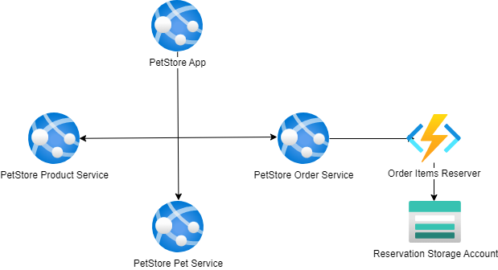

# Module 6: Functions and Storage

## Task

The source code is available [here](../../../petstore).

The PetStore application enables customers to add products to their shopping carts, effectively initializing orders. However, currently, there is no mechanism in place to transmit requests to the storage to reserve the selected items.

> **NOTE:** For the deployment of services in this and all subsequent tasks, you may choose to use either **Azure App Services or Azure Container Apps** (the diagrams will depict App Services).

**Please complete the following task:**

1. Implement a new OrderItemsReserver service, utilizing Azure Functions, with Java as the runtime and container deployment.
2. Establish communication between the PetStore application and the OrderItemsReserver through an HTTP call.
3. The OrderItemsReserver should generate order requests and upload them as a JSON file to Blob Storage.
4. This should happen every time a customer updates the shopping cart during the same session.
5. The generated request should contain order details and the product list.
6. Ensure that the file is overwritten for each user session whenever an update is made (use session ID for file naming).
7. (Optional) Utilize Azure CLI to automate resource deployment.

**Definition of Done:**

1. The PetStore application has been modified and deployed to the Azure App Services or Azure Container Apps.
2. The OrderItemsReserver service has been developed and deployed as an Azure Function, with Java as the runtime and container deployment.
3. Every time a customer updates the shopping cart within the same session, a new JSON file containing the order details appears in Blob Storage.

**Consider providing the following screenshots as evidence of your task execution:**

- Screenshots showing the configuration of the OrderItemsReserver Azure Functions.
- Screenshots verifying that the OrderItemsReserver function has been deployed using container deployment configurations.
- Screenshots displaying the configuration of Blob Storage.
- Screenshots of the code within the PetStore application that establishes communication with OrderItemsReserver via an HTTP call.
- Screenshots highlighting the code section responsible for uploading JSON files to Blob Storage.
- Screenshots of the PetStore application's UI, focusing on the shopping cart section.
- Screenshots illustrating the content and structure of a generated JSON file in Blob Storage.
- Screenshots confirming that the JSON file is overwritten with each user session update.
- A screenshot showing the list of Azure resources that correspond to the diagram.

  <ul>
    <li>When presenting the results of the practical tasks, please <a href="../common/presenting-results/presenting-results.md">follow these guidelines</a>.</li>
    <li><strong>When you have completed the task, attach the file(s) to the "Answer" field. Files should include a PDF/DOCX file with screenshots (optionally, you can also add a GIF/MP4 file). Please add a link to the updated Pet Store solution in a public Git repository to your PDF/DOCX file. Click "Submit."</strong></li>
    <li>Delete unnecessary resources.</li>
  </ul>

>**IMPORTANT:** Leaving resources running can result in additional costs. Either delete resources individually or remove the entire set of resources by deleting the resource group.
