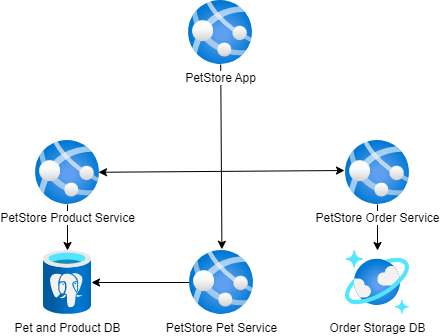

# Module 7: Databases. PostgreSQL. CosmosDB

## Task

The source code is available [here](../../../petstore).

> **NOTE:** For the deployment of services in this and all subsequent tasks, you may choose to use either **Azure App Services or Azure Container Apps** (the diagrams will depict App Services).

### Sub-task 1

Currently, both the PetStore Pet and Product Services utilize an in-memory storage system for handling product and pet information.

**Please complete the following task:**

1. Create an instance of Azure Database for PostgreSQL.
2. Use it as a replacement for the current in-memory storage system.
3. (Optional) Utilize Azure CLI to automate resource deployment.

**Useful links:**

- [DDL and DML scripts](scripts)

**Definition of Done:**

1. The PetStore application has been modified and deployed to the Azure App Services or Azure Container Apps.
2. An Azure Database for PostgreSQL instance is created.
3. Tables are created.
4. The PetStore's Pet and Product Services work correctly with Azure Database for PostgreSQL.

### Sub-task 2

The PetStore application enables customers to place orders. However, currently, the Order Service relies on an in-memory JSON-based cache to store order information.

**Please complete the following task:**

1. Implement the Order Storage using CosmosDB (select Azure Cosmos DB for NoSQL).
2. Ensure that a new record is generated in the Order Storage when a customer creates an order.
3. (Optional) Utilize Azure CLI to automate resource deployment.

**Definition of Done:**

1. The PetStore application has been modified and deployed to the Azure App Services or Azure Container Apps.
2. Azure Cosmos DB account, database, and a specific container within the database have been created.
3. Once a customer creates an order, the new record appears in the Order Storage.

**Consider providing the following screenshots as evidence of your task execution:**

*Sub-task 1: Replace In-Memory Storage with Azure Database for PostgreSQL*

- Screenshots displaying the configuration of the Azure Database for PostgreSQL.
- Screenshots showcasing the modified code in the Pet and Product Services, illustrating the integration of PostgreSQL as the new storage system.
- Screenshots of the PostgreSQL database schema, showing the created tables and their structure.

*Sub-task 2: Implement Order Storage using CosmosDB*

- Screenshots showing the configuration of CosmosDB.
- Screenshots demonstrating the modified code in the Order Service, highlighting the integration of CosmosDB as the new storage system for orders.
- Screenshots illustrating the application's functionality for placing an order.
- Screenshots of the CosmosDB Data Explorer, displaying the newly created record in Order Storage.

- A screenshot showing the list of Azure resources that correspond to the diagram.

  <ul>
    <li>When presenting the results of the practical tasks, please <a href="../common/presenting-results/presenting-results.md">follow these guidelines</a>.</li>
    <li><strong>When you have completed the task, attach the file(s) to the "Answer" field. Files should include a PDF/DOCX file with screenshots (optionally, you can also add a GIF/MP4 file). Please add a link to the updated Pet Store solution in a public Git repository to your PDF/DOCX file. Click "Submit."</strong></li>
    <li>Delete unnecessary resources.</li>
  </ul>

>**IMPORTANT:** Leaving resources running can result in additional costs. Either delete resources individually or remove the entire set of resources by deleting the resource group.
