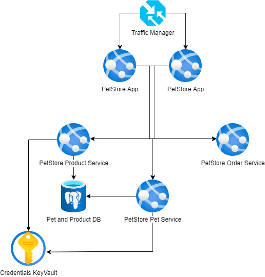

# Module 7: Key Vault

## Task

The source code is available [here](../../../petstore).

Azure Key Vault is a service that offers centralized secrets management, granting comprehensive control over access policies and audit history. In this module, you will practice working with secrets from Azure Key Vault in your App Service or Azure Function application, all without necessitating any code alterations.

**Please complete the following task:**

1. Create a Key Vault instance.
2. Store the Azure Database for PostgreSQL url, username, and password (or connection string) as secrets in the Key Vault.
3. Enable managed identity for the two apps that use the Azure Database for PostgreSQL.
4. Create a Key Vault access policy for the two apps that use the Azure Database for PostgreSQL.
5. Obtain the unique secret URIs associated with the stored database secrets.
6. Update the App Service's application settings to include the Azure Key Vault reference syntax.
7. Reference the stored secret URIs in your apps' settings to securely access the database secrets.
8. (Optional) Utilize Azure CLI to automate resource deployment.

**Definition of Done:**

1. Database credentials are not stored in configuration files or code.
2. A Key Vault is created with secret values assigned for the database url, username, and password (or connection string).
3. Managed identity is enabled for the App Services.
4. A Key Vault access policy is created with the appropriate permissions for the App Services managed identity.
5. A new setting is added to the App Service's application settings, referencing the Key Vault secrets via their unique URLs.
6. The App Service successfully utilizes the configuration settings to access the Key Vault secrets.

**Consider providing the following screenshots as evidence of your task execution:**

- Screenshots displaying the created Key Vault instance.
- Screenshots illustrating the database url, username, and password (or connection string) stored as secrets in the Key Vault.
- Screenshots showing the enabled managed identity for the App Services.
- Screenshots highlighting the created Key Vault access policy for the App Services' managed identity.
- Screenshots revealing the unique secret URIs associated with the stored database url, username, and password (or connection string).
- Screenshots of the updated App Service application settings, which include the Azure Key Vault reference syntax.
- Screenshots displaying your apps' settings that reference the stored secret URIs for database url, username, and password (or connection string).
- A screenshot showing the list of Azure resources that correspond to the diagram.

  <ul>
    <li>When presenting the results of the practical tasks, please <a href="../common/presenting-results/presenting-results.md">follow these guidelines</a>.</li>
    <li><strong>When you have completed the task, attach the file(s) to the "Result" field. Files should include a PDF/DOCX file with screenshots (optionally, you can also add a GIF file). Please add a link to the updated Pet Store solution in a public Git repository to your PDF/DOCX file. Update the status to "Done."</strong></li>
    <li>Delete unnecessary resources.</li>
  </ul>

>**IMPORTANT:** Leaving resources running can result in additional costs. Either delete resources individually or remove the entire set of resources by deleting the resource group.