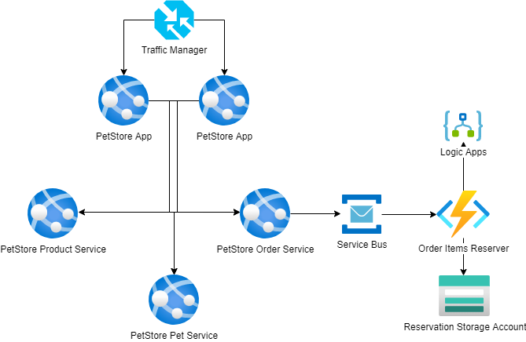

# Module 8: Service Bus. Event Hub. Event Grid. Logic Apps

## Task

The source code is available [here](../../../petstore).

The PetStore application enables customers to add products to their shopping carts, effectively initializing orders. Currently, the mechanism in place to transmit requests to the storage to reserve the selected items is implemented as a OrderItemsReserver service, utilizing HTTP Trigger Azure Functions.

**Please complete the following task:**

1. Establish communication between the PetStore application and the OrderItemsReserver through a messaging service (Azure Service Bus).
2. Update the OrderItemsReserver service to utilize Service Bus Trigger Azure Functions instead of HTTP Trigger.
3. The OrderItemsReserver should generate order requests and upload them as a JSON file to Blob Storage.
4. This should happen every time a customer updates the shopping cart during the same session.
5. The generated request should contain order details and the product list.
6. Ensure that the file is overwritten for each user session whenever an update is made. Use the customer's session ID as the file name for that.
7. Implement a retry policy for uploading to Blob Storage. In case of an unsuccessful attempt, the code will make up to 3 retry attempts.
8. Implement a fallback scenario using Logic Apps. If the file fails to upload after 3 attempts (due to storage unavailability, exceptions during processing, etc.) an email containing the order details should be sent. Please use a dead-letter queue.
9. (Optional) Utilize Azure CLI to automate resource deployment.

**Definition of Done:**

1. The PetStore application has been modified and deployed to the Azure App Services.
2. The OrderItemsReserver service has been updated and deployed as a Service Bus Trigger Azure Function.
3. The communication service (Service Bus) between the PetStore application and the OrderItemsReserver service is created and properly configured.
4. Every time a customer updates the shopping cart within the same session, a new JSON file containing the order details appears in Blob Storage.
5. If the file cannot be created in Blob Storage, an email with the order details is sent after 3 retry attempts.

**Consider providing the following screenshots as evidence of your task execution:**

- Screenshots displaying the created Azure Service Bus instance in the Azure portal.
- Screenshots showcasing the modified code in the PetStore application, highlighting the integration of Azure Service Bus communication.
- Screenshots illustrating the updated code in the OrderItemsReserver service, demonstrating the transition from HTTP Trigger to Service Bus Trigger in Azure Functions.
- Screenshots of the Logic Apps configuration, set up to send an email with order details as a fallback scenario.
- Screenshots showing the JSON files generated and uploaded to Blob Storage after changes to the shopping cart during a user session.
- Screenshots of the Blob Storage container, revealing the updated JSON files for each user session.
- Screenshots depicting the implementation of the retry policy for uploads to Blob Storage.
- Screenshots confirming the successfully sent email containing order details as a result of the fallback scenario.
- A screenshot showing the list of Azure resources that correspond to the diagram.

  <ul>
    <li>When presenting the results of the practical tasks, please <a href="../common/presenting-results/presenting-results.md">follow these guidelines</a>.</li>
    <li><strong>When you have completed the task, attach the file(s) to the "Result" field. Files should include a PDF/DOCX file with screenshots (optionally, you can also add a GIF file). Please add a link to the updated Pet Store solution in a public Git repository to your PDF/DOCX file. Update the status to "Done."</strong></li>
    <li>Delete unnecessary resources.</li>
  </ul>

>**IMPORTANT:** Leaving resources running can result in additional costs. Either delete resources individually or remove the entire set of resources by deleting the resource group.