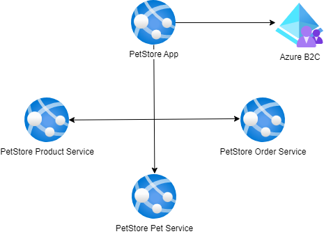

# Module 10: Authentication

## Task

The source code is available [here](../../../petstore).

> **NOTE:** For the deployment of services in this and all subsequent tasks, you may choose to use either **Azure App Services or Azure Container Apps** (the diagrams will depict App Services).

**Please complete the following task:**

1. Configure Microsoft Entra's Azure Active Directory B2C (Azure AD B2C) as an identity provider.
2. Register the PetStore App as an Azure AD B2C application.
3. Define and set up user flows (like sign-up and sign-in) for the PetStore App within Azure AD B2C.
4. Configure the PetStore App to use Azure AD B2C.
5. Ensure that users can successfully log in to the PetStore App using Azure AD B2C authentication.
6. (Optional) Utilize Azure CLI to automate resource deployment.

**Definition of Done:**

1. Azure AD B2C identity provider has been configured.
2. PetStore App has been registered as an application in Azure AD B2C.
3. User flows have been configured for the PetStore App application.
4. PetStore App configuration has been configured to use Azure AD B2C.
5. Localhost has not been used as the sole redirect URI, reply URL, or logout success URL.
6. Users can now log in to the PetStore App via Azure AD B2C authentication.

**Consider providing the following screenshots as evidence of your task execution:**

- Screenshots displaying the configured Azure AD B2C identity provider in the Azure portal.
- Screenshots showing the registration of the PetStore App as an Azure AD B2C application, including App Registrations, Authentication (with Redirect URIs), Certificates & Secrets, and other pages.
- Screenshots depicting the defined and set up user flows (such as sign-up and sign-in) for the PetStore App within Azure AD B2C.
- Screenshots highlighting the PetStore App configuration to utilize Azure AD B2C.
- Screenshots illustrating successful user logins to the PetStore App via Azure AD B2C authentication.

  <ul>
    <li>When presenting the results of the practical tasks, please <a href="../common/presenting-results/presenting-results.md">follow these guidelines</a>.</li>
    <li><strong>When you have completed the task, attach the file(s) to the "Answer" field. Files should include a PDF/DOCX file with screenshots (optionally, you can also add a GIF/MP4 file). Please add a link to the updated Pet Store solution in a public Git repository to your PDF/DOCX file. Click "Submit."</strong></li>
    <li>Delete unnecessary resources.</li>
  </ul>

>**IMPORTANT:** Leaving resources running can result in additional costs. Either delete resources individually or remove the entire set of resources by deleting the resource group.
