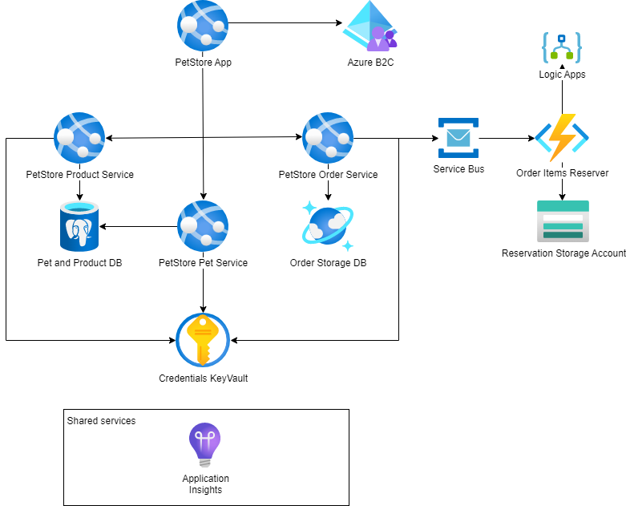

# Module 11: Final Assignment

## Task

The source code is available [here](../../../petstore).

Throughout the course, we gradually built the PetStore application step by step.
Now, for the final task, your goal is to bring all these individual pieces together into a single solution, following the diagram. Additionally, make sure to address the points mentioned below.

> **NOTE:** For the deployment of services in this task, you may choose to use either **Azure App Services or Azure Container Apps** (the diagrams will depict App Services).

**Please complete the following task:**

1. PetStore public API services should be available for auto-scaling.
2. PetStore Web App should support deployment slots.
3. Pet and Product Services should use Azure SQL as a database.
4. Order Service should use Cosmos DB as a database.
5. Order Items Reserver function should be able to create Reservation JSON files in Azure Blob Storage by communicating through Service Bus and handle errors by sending the email through Logic Apps.
6. PetStore Web App is protected by Azure AD B2C for authentication.

**Definition of Done:**

1. The PetStore Public API services are configured for auto-scaling.
2. Deployment slots are set up for the PetStore Web App.
3. The Pet and Product Services have successfully migrated to Azure Database for PostgreSQL.
4. The Order Service has been updated to use Cosmos DB as its database.
5. The Order Items Reserver Azure Function is able to create Reservation JSON files in Azure Blob Storage by communicating through the Service Bus.
6. Error handling is implemented to send emails through Logic Apps when issues with creating Reservation JSON files are encountered.
7. The PetStore Web App is secured with Azure AD B2C for authentication.

**Consider providing the following screenshots as evidence of your task execution:**

- Screenshots showing the auto-scaling settings for PetStore Public API Services in the Azure portal.
- Screenshots depicting the deployment slots set up for the PetStore Web App.
- Screenshots highlighting the connection between Azure Database for PostgreSQL and the Pet and Product Services.
- Screenshots illustrating CosmosDB's connection to the Order Service.
- Screenshots revealing the Order object within CosmosDB.
- Screenshots showcasing the configuration of the Order Items Reserver Azure Function.
- Screenshots detailing the Azure Service Bus configuration.
- Screenshots capturing the creation of Reservation JSON files in Azure Blob Storage.
- Screenshots documenting the error-handling implementation that sends emails through Logic Apps when issues arise.
- Screenshots demonstrating the B2C authentication mechanism.
- A screenshot showing the list of Azure resources that correspond to the diagram.

**Check your peer's task**

1. Please review the Teams channel (Files tab) for information about the participant whose task you are assigned to assess.
2. Coordinate a meeting with your peer.
3. During this meeting, share your respective solutions with each other.
4. Evaluate how your peer completed the assignment by referring to the provided Definition of Done criteria.
5. Visit [learn.epam.com](http://learn.epam.com) - Contribution tab - Mentorship - Expert View.
6. Locate the CloudX Associate program and identify the participant whose task you have reviewed.
7. Provide a rating for the completed task.

  <ul>
    <li>When presenting the results of the practical tasks, please <a href="../common/presenting-results/presenting-results.md">follow these guidelines</a>.</li>
    <li><strong>When you have completed the task, attach the file(s) to the "Answer" field. Files should include a PDF/DOCX file with screenshots (optionally, you can also add a GIF/MP4 file). Please add a link to the updated Pet Store solution in a public Git repository to your PDF/DOCX file. Click "Submit."</strong></li>
    <li>Delete unnecessary resources.</li>
  </ul>

>**IMPORTANT:** Leaving resources running can result in additional costs. Either delete resources individually or remove the entire set of resources by deleting the resource group.
