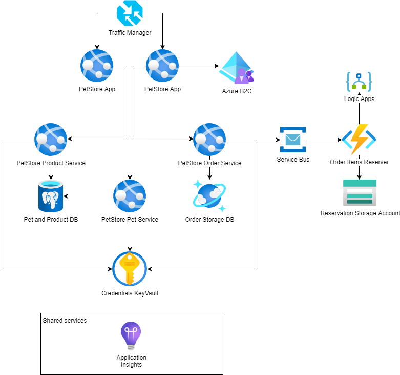

# Module 11: Final Assignment

## Task

The source code is available [here](../../../petstore).

Throughout the course, we gradually built the PetStore application step by step.
Now, for the final task, your goal is to bring all these individual pieces together into a single solution, following the diagram. Additionally, make sure to address the points mentioned below.

**Please complete the following task:**

1. PetStore Web Apps are balanced with Traffic Manager.
2. PetStore Web Apps should be available for auto-scaling.
3. PetStore Web Apps should support deployment slots (at least one instance of Web).
4. Pet and Product Services should use Azure SQL as a database.
5. Order Service should use Cosmos DB as a database.
6. Order Items Reserver function should be able to create Reservation JSON files in Azure Blob Storage by communicating through Service Bus and handle errors by sending the email through Logic Apps.
7. PetStore Web App is protected by Azure B2C for authentication.

**Definition of Done:**

1. All points above have been implemented.
2. The following pieces of evidence are shared:
   - A link to a public Git repository with the updated Pet Store solution.
   - A screenshot of the list of Azure resources that reflects the diagram.
   - A screenshot of the Azure Storage JSON file produced by the Order Items Reserver Function.
   - A screenshot of the Order object in CosmosDB.
   - A screenshot of the Azure B2C configuration.

**Check your peer's task**

1. Please review the Teams channel (Files tab) for information about the participant whose task you are assigned to assess.
2. Coordinate a meeting with your peer.
3. During this meeting, share your respective solutions with each other.
4. Evaluate how your peer completed the assignment by referring to the provided Definition of Done criteria.
5. Visit [learn.epam.com](http://learn.epam.com) - Contribution tab - Mentorship - Expert View.
6. Locate the CloudX Associate program and identify the participant whose task you have reviewed.
7. Provide a rating for the completed task.

  <ul>
    <li>When presenting the results of the practical tasks, please <a href="../common/presenting-results/presenting-results.md">follow these guidelines</a>.</li>
    <li>When you have completed the task, attach the screenshot to the "Result" field, and update the status to "Done."</li>
    <li>Delete resources.</li>
  </ul>

>**IMPORTANT:** Leaving resources running can result in additional costs. Either delete resources individually or remove the entire set of resources by deleting the resource group.